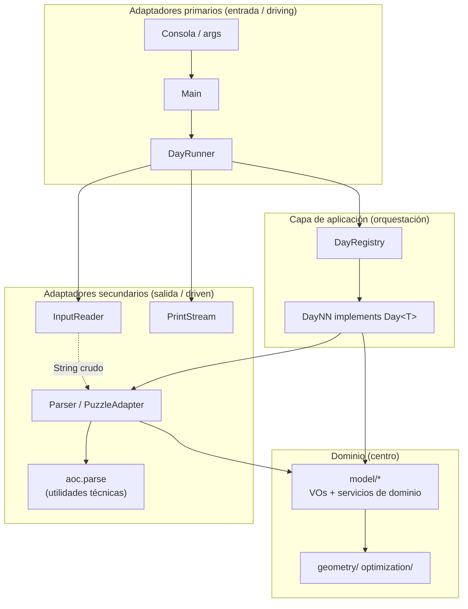
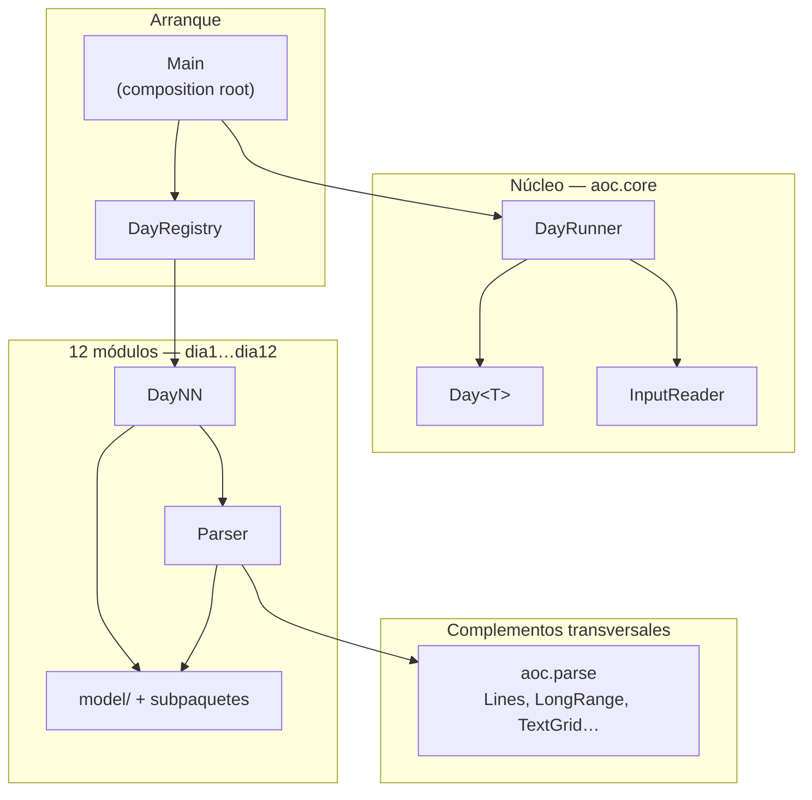
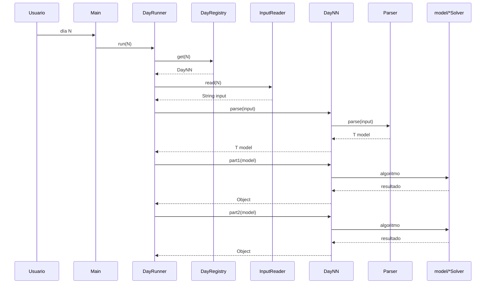

# Arquitectura del proyecto — Advent of Code 2025

Este documento describe **cómo está organizado el proyecto de verdad** (paquetes, flujos, clases), **por qué se tomó cada decisión** y **hasta qué punto** encaja con arquitectura hexagonal y DDD. No es un manifiesto teórico: donde el código no cumple el ideal, se dice explícitamente.

Cada puzzle concreto tiene su desglose por clases en `RetosDia1.md` … `RetosDia12.md`.

---

## 1. De qué va este proyecto (y qué no es)

Advent of Code es una colección de **12 problemas independientes**. Cada uno tiene su propio input, su propia lógica y, a menudo, su propio algoritmo (BFS, simplex, backtracking…). Lo único que comparten es el **ritual de ejecución**: leer un fichero, resolver parte 1, resolver parte 2, imprimir resultados.

La arquitectura refleja eso:

- **Un monolito** (un JAR, un `main`) — no tiene sentido repartir 12 puzzles en microservicios.
- **Doce módulos verticales** (`dia1`…`dia12`) — cada uno es un mini-proyecto autocontenido.
- **Un núcleo mínimo compartido** (`core`, `registry`, `parse`) — solo lo que los 12 días necesitan igual.

### Cómo leer hexagonal y DDD en este documento

El proyecto está **organizado al estilo** hexagonal + DDD **lite**: separación dominio / entrada / orquestación, un contexto por día, records con comportamiento donde compensa. **No** es una implementación enterprise completa (sin interfaces-puerto por operación, sin capas globales `domain/application/infrastructure`, sin repositorios ni eventos de dominio).

Usamos ese vocabulario como **marco para leer el código**, no como certificación de que cada clase cumple un checklist. La sección 2.6 lista los **límites reales** verificados contra el repositorio.

**No es** una aplicación web (no hay MVC), **no es** un framework reutilizable. Tampoco es un monolito plano de scripts: hay dominio con comportamiento (`Dial`, `LongRange`, solvers en `model/`), no solo DTOs vacíos — aunque varios records **sí son anémicos** (véase §2.2).

### Principio rector del refactor

Toda mejora debe poder aplicarse **de forma aislada**: el proyecto compila y devuelve **las mismas respuestas** después de cada paso. Por eso los cambios fueron incrementales (core → utilidades → value objects → limpieza por día), no una reescritura big-bang.

### Analogía rápida

Imagina un edificio con 12 apartamentos (los días). Todos comparten la **entrada del edificio** (`Main`), el **ascensor** (`DayRunner`) y las **tuberías comunes** (`InputReader`, `aoc.parse`). Pero la **distribución y el mobiliario** de cada piso es distinto: el día 10 tiene una sala de optimización (`optimization/`), el día 12 un vestíbulo de adaptadores (`adapter/`). No forzamos el mismo número de habitaciones en todos los pisos.

---

## 2. Arquitectura hexagonal + DDD (marco conceptual)

Esta sección explica **cómo interpretar** el diseño con vocabulario hexagonal y DDD. El código **sí aplica** muchas de esas ideas (dependencias hacia el dominio, parsers como frontera, contextos separados), pero **no al 100%** de un sistema hexagonal o DDD táctico formal.

---

### 2.1. Hexagonal (Ports & Adapters) — la idea en una frase

> **El código del puzzle (algoritmos y reglas) intenta vivir en `model/`**, separado del runner y del filesystem. El texto de input entra por **parsers/adaptadores**; los solvers no abren ficheros.

En hexagonal estricto, el dominio no dependería de nada externo. Aquí **`model/` sí importa `aoc.parse`** (`LongRange`, `TextGrid` en días 4, 5, 7…) — es un **shared kernel** acordado, no dominio puro. Y el día 4 usa **`TextGrid` directamente como modelo**, sin VO propio del contexto (compromiso documentado en §2.6).

Alistair Cockburn propuso la arquitectura hexagonal para que la lógica de negocio **no dependa** de bases de datos, HTTP, frameworks ni ficheros. En AoC el “negocio” es absurdo desde el punto de vista empresarial (contar caminos en un grafo, empaquetar polióminos), pero **estructuralmente es lo mismo**: reglas del enunciado en el centro, I/O en el perímetro.

#### Diagrama hexagonal del proyecto



#### Puertos (ports) — contratos, no siempre interfaces Java

En hexagonal puro, un **puerto** es una interfaz que el dominio expone o requiere. Aquí los “puertos” son **deliberadamente ligeros**:

| Puerto | Dónde está | Qué contrata |
|--------|------------|--------------|
| **Puerto de módulo puzzle** | `Day<T>` | «Todo día sabe parsearse, resolver parte 1 y parte 2 sobre su modelo» |
| **Puerto de lectura de input** | (implícito) | `InputReader.read(int)` — el runner necesita un string de entrada |
| **Puerto de parseo** | (implícito por convención) | `Parser.parse(String)` en cada `diaX` — no hay interfaz `Parser<T>` común porque cada formato es único |
| **Puerto de salida** | `PrintStream` inyectado en `DayRunner` | Imprimir resultados sin acoplarse a `System.out` |

**Por qué no hay `interface PuzzleParser<T>` global:** en DDD/hexagonal enterprise tendría sentido si intercambiáramos parsers (JSON vs CSV). En AoC **cada puzzle tiene un formato distinto** y nunca se intercambian entre sí. Forzar una interfaz común sería una abstracción vacía. La convención `diaX.Parser` *es* el puerto inbound de ese bounded context.

#### Adaptadores primarios (driving / inbound)

Son quienes **inician** la acción — “quieren” resolver un día:

| Adaptador | Rol hexagonal |
|-----------|---------------|
| **`Main`** | Punto de entrada humano (args o pregunta por consola). Traduce intención del usuario → `runner.run(N)`. |
| **`DayRunner`** | Orquesta el ritual AoC (leer → parse → part1 → part2 → imprimir). Conoce el **puerto** `Day<T>`, no tipos concretos como `Machine` o `Graph`. |
| **`DayRegistry`** | Catálogo estático. **Acoplamiento real:** importa las 12 clases `Day01`…`Day12` concretas (no hay plugins). |

`DayRunner` es la pieza más “aplicación” del sistema global: orquesta lectura → parseo → resolución → impresión **sin saber** qué es un `Machine` o un `Graph`.

#### Adaptadores secundarios (driven / outbound)

Son quienes el núcleo **usa** para hablar con el exterior:

| Adaptador | Rol hexagonal |
|-----------|---------------|
| **`InputReader`** | Adaptador de **infraestructura** al classpath. Convierte «día N» → contenido de `/InputNN.txt`. |
| **`Parser` (cada día)** | Adaptador de **formato de input** → objetos de dominio. Anti-corruption layer entre el texto del puzzle y `model/`. |
| **`PuzzleAdapter`, `ShapeParser`, `RegionParser` (d12)** | Adaptadores especializados dentro del borde inbound del día 12. |
| **`Manifold` (d7)** | Adaptador de `TextGrid` (infra compartida) → lenguaje del dominio (`Position`, `start()`). |
| **`aoc.parse.*`** | Adaptadores/utilidades **técnicas** compartidas: traducen trozos de texto neutros (líneas, coords, rangos) sin semántica de puzzle. |
| **`PrintStream`** | Adaptador de salida hacia consola (u otro sink en tests). |

**Flujo inbound típico** (el parseo lo dispara `DayNN.parse`, invocado por `DayRunner`; no un adaptador aparte del propio día):

```
Fichero Input10.txt
  → InputReader (infra: bytes → String)
  → Day10.parse(input) → Parser dia10 (formato → List<Machine>)
  → Day10.part2(model) (orquestación)
  → JoltageSolver (model/)
  → PrintStream (infra: resultado → texto)
```

Las clases en `model/` **no** abren ficheros ni leen `InputReader`. **`Parser` vive fuera de `model/`** y es quien hace `split`/regex; los solvers reciben objetos ya construidos. Excepción parcial: **`ForkliftAccessChecker` (d4) opera sobre `TextGrid`**, tipo del shared kernel, no sobre un VO propio del día 4.

#### Regla de dependencia (qué cumplimos y qué no)

**Cumplido en el código (comprobado):**

| Regla | Evidencia |
|-------|-----------|
| `model/` no importa `aoc.core` | Ningún fichero en `dia*/model/` importa `Day` ni `DayRunner` |
| Los días no se importan entre sí | No hay `import aoc.dia7` dentro de `dia10`, etc. |
| I/O de ficheros solo en `InputReader` | Parsers reciben `String` ya leído |
| `core` depende de `Day<?>`, no de solvers concretos | `DayRunner` solo usa la interfaz |

**No cumplido al 100% (hexagonal/DDD estricto):**

| Matiz | Realidad |
|-------|----------|
| Dominio autónomo | `model/` importa `aoc.parse` (días 2, 4, 5, 7…) |
| Modelo siempre del contexto | Día 4: `Day<TextGrid>` — el modelo **es** infra compartida |
| Puertos explícitos | Solo `Day<T>`; el parseo es convención `Parser.parse`, no interfaz |
| Registry desacoplado | `DayRegistry` conoce las 12 implementaciones concretas |

La dependencia general sigue siendo **hacia el centro del puzzle** (`model/` + solvers), no hacia `Main` ni hacia el filesystem.

---

### 2.2. DDD — cómo se manifiesta en el proyecto

Domain-Driven Design organiza el software alrededor del **modelo del problema** y de **contextos delimitados** donde ese modelo tiene un significado coherente. AoC es casi un regalo pedagógico para DDD: **12 contextos delimitados literalmente distintos** (cada día es otro “mundo”).

#### Bounded Context (contexto delimitado)

Cada paquete `aoc.diaX` es un **bounded context**:

| Contexto | Lenguaje ubiquo (ejemplos) | No confundir con… |
|----------|---------------------------|-------------------|
| `dia1` | `Dial`, `Rotation`, clic en 0 | `Position` del dia7 |
| `dia5` | `IngredientDatabase`, frescura, rango | `LongRange` genérico (está en shared kernel `parse`) |
| `dia7` | `Manifold`, tachyon, split | `TextGrid` del dia4 (misma infra, distinto contexto) |
| `dia11` | `Graph`, caminos, `you`/`out` | Grafos genéricos de librería |

**No hay un “dominio global” de Advent of Code.** Unificar `Tile`, `Point3D` y `Position` en un solo tipo sería violar DDD: son conceptos homónimos en contextos distintos. Por eso conviven records similares en paquetes separados.

**Shared Kernel (núcleo compartido):** `aoc.parse` y `aoc.core` son el kernel compartido **mínimo** entre contextos — solo utilidades técnicas y ritual de ejecución, no reglas de puzzles.

#### Value Objects (objetos valor)

En DDD, un VO es inmutable, se define por valor y puede llevar comportamiento. En este repo hay **tres niveles reales** (no todo record es un VO rico):

| Nivel | Ejemplos | Comportamiento |
|-------|----------|----------------|
| **VO rico / shared kernel** | `LongRange` | `contains`, `connectsWith`, `union` |
| **VO con API mínima** | `Graph` (`neighbors`), `Shape` (`cells`, orientaciones), `Dial` | Algo de lógica en el tipo |
| **Records anémicos** | `Tile`, `Machine`, `BatteryBank`, `Point3D` | Solo datos; la lógica está en `*Solver` / `*Checker` |

Usamos **records** por inmutabilidad superficial y claridad, pero **anémico ≠ malo** en AoC: un `Machine` es solo la foto parseada de una línea del input; el algoritmo vive en `ButtonSolver` / `JoltageSolver`.

**Matiz de inmutabilidad:** `Graph` es un record que **envuelve un `Map`**. Si el mapa fuera mutable desde fuera, el grafo dejaría de ser inmutable; hoy el `Parser` construye el mapa y no lo expone, pero **no hay defensa en profundidad** (copias defensivas). Lo mismo aplica a listas dentro de records si alguien retuviera referencias mutables.

#### Entidades (entities)

Entidad = objeto con **identidad** que persiste en el tiempo aunque cambien sus atributos.

| Candidato | ¿Entidad? | Por qué |
|-----------|-----------|---------|
| `Dial` (dia1) | **Sí** | Tiene `position` mutable que evoluciona rotación a rotación |
| `Packer` (dia12) | Instancia con estado de búsqueda | Estado interno durante backtracking (rejilla `occupied`) — más “servicio con estado de algoritmo” que entidad de negocio |
| Records (`Tile`, `Machine`…) | No | Son VOs / DTOs de dominio |

AoC tiene **pocas entidades** porque la mayoría de puzzles son funciones sobre datos inmutables parseados una vez. Eso es normal: no todo dominio necesita entidades.

#### Agregados (aggregates) — uso del término con cautela

En DDD estricto, un agregado tiene **raíz**, **invariantes** y **frontera de consistencia**. Aquí usamos el término solo para **contenedores parseados** que agrupan varias piezas:

| Contenedor | Qué agrupa | ¿Invariantes en código? |
|------------|------------|-------------------------|
| `IngredientDatabase` | Rangos + IDs | No validadas en el record; confiamos en el `Parser` |
| `PuzzleInput` | Figuras + regiones | Índices de regiones validados al parsear, no en el record |
| `Worksheets` | Dos hojas del mismo input | Coherencia por construcción en `Day06.parse` |

No hay `@AggregateRoot`, factories ni repositorios: el objeto se **construye entero al parsear**, se usa en memoria un run y se descarta. Llamarlos «agregados DDD» es **metáfora útil**, no implementación táctica completa.

#### Servicios de dominio (domain services)

Operaciones que **no pertenecen naturalmente a un solo VO**:

| Servicio | Contexto | Por qué no es método de un VO |
|----------|----------|-------------------------------|
| `InvalidIdChecker` | dia2 | Evalúa reglas sobre `long` sueltos en rangos |
| `FreshnessChecker` | dia5 | Cruza IDs con rangos y fusiona listas |
| `PathCounter` | dia11 | DFS sobre todo el `Graph` |
| `Packer` | dia12 | Backtracking multi-figura |
| `JoltageSolver` | dia10 | Orquesta ILP sobre una `Machine` |
| `CircuitAnalyzer` | dia8 | Algoritmo global sobre lista de puntos |

Son clases con métodos estáticos o instancia **sin ser entidades**: encapsulan algoritmo puro de dominio.

#### Servicios de aplicación (application services)

En DDD enterprise, coordinan casos de uso sin lógica de negocio.

Aquí: **`DayNN`** cumple ese rol **por contexto**:

```java
// Day10 — aplicación del contexto "factory"
public Object part1(List<Machine> machines) {
    return machines.stream().mapToInt(ButtonSolver::minPresses).sum();
}
```

`Day10` no implementa BFS ni simplex; **elige qué servicio de dominio** invocar en cada parte. A escala global, **`DayRunner`** es el servicio de aplicación transversal que aplica el ritual AoC a cualquier contexto.

#### Anti-Corruption Layer (ACL)

Evita que el **formato crudo del input** contamine los solvers.

| ACL | Qué protege | Matiz |
|-----|-------------|-------|
| **`Parser` de cada día** | Solvers no ven el `String` original | El `Parser` **sí** conoce regex/split; vive fuera de `model/` |
| **`PuzzleAdapter` (d12)** | Dos formatos de línea → `PuzzleInput` | — |
| **`Manifold` (d7)** | `TextGrid` genérico → `Position`, `start()` | El simulador no importa `TextGrid`; pero `Manifold` sí |
| **`JoltageSolver.buildMatrix` (d10)** | `Machine` → matrices LP | La fachada oculta `optimization/` |

**Lo que la ACL no hace:** no aisla el dominio del **shared kernel** (`LongRange`, `TextGrid`). Esos tipos entran en `model/` por decisión pragmática de DRY.

#### Context mapping (mapa entre contextos)

Los 12 contextos **no se llaman entre sí**. No existe `dia10` importando `dia7.model`. El único “mapa” es:

```
dia1 … dia12  ──implementan──▶  Day<T>  ◀──conoce──  core + registry
                │
                └── usan (opcional) ──▶  aoc.parse (shared kernel)
```

Relación **Shared Kernel** entre cada `diaX` y `aoc.parse`/`aoc.core`. No hay **Customer/Supplier** entre días porque no hay integración entre puzzles.

---

### 2.3. Hexagonal + DDD juntos: un ejemplo completo (día 12)

Recorrer un flujo con ambos vocabularios ayuda a fijar ideas:

| Paso | Pieza | Hexagonal | DDD |
|------|-------|-----------|-----|
| 1 | Usuario elige día 12 | Adaptador primario (`Main`) | — |
| 2 | `InputReader.read(12)` | Adaptador secundario (infra) | — |
| 3 | `Parser.parse` → `PuzzleAdapter` | Adaptador inbound (ACL) | Traducción al lenguaje ubiquo |
| 4 | `PuzzleInput` | — | Contenedor parseado (agregado *lite*) |
| 5 | `Day12.part1` | Servicio de aplicación | Caso de uso «contar regiones válidas» |
| 6 | `Packer.fits` | — | Servicio de dominio |
| 7 | `Shape`, `Region` | — | VOs con reglas (`cells()`, `area()`) |
| 8 | `PrintStream` | Adaptador secundario (salida) | — |

Ninguna fila mezcla responsabilidades: el parseo no empaqueta, el empaquetador no lee ficheros.

---

### 2.4. Ceremonias que no implementamos (y alternativa real)

| Ceremonia enterprise | Por qué no está | Qué hay en su lugar |
|---------------------|-----------------|---------------------|
| Interfaz por cada puerto | YAGNI; 12 formatos únicos | `Day<T>` + convención `Parser.parse` |
| Capas globales `domain/application/infrastructure` | Cada puzzle es su propio mundo | `model/` + `DayNN` por `diaX` |
| Repositorios | Sin persistencia | Parseo → modelo en memoria → solver |
| Eventos de dominio | Sin side effects entre agregados | — |
| CQRS | Part1/part2 comparten el mismo modelo | `Day<T>` con parse único |
| Factories / `@AggregateRoot` | Contenedores simples bastan | Records + parsers |

Esto **no invalida** el diseño; define su **nivel de ambición**: solucionador AoC bien modular, no sistema DDD de producción.

---

### 2.5. Resumen en una tabla (correspondencia aproximada)

| Concepto | En este proyecto | Fidelidad |
|----------|------------------|-----------|
| **Centro del hexágono** | `diaX.model` (+ `geometry/`, `optimization/`) | Alta para algoritmos; media por dependencia de `aoc.parse` |
| **Puerto inbound** | `Day<T>`, convención `Parser.parse` | Media — un puerto formal, parseo por convención |
| **Puerto outbound** | `InputReader`, `PrintStream` | Alta |
| **Adaptador driving** | `Main`, `DayRunner` | Alta |
| **Adaptador driven** | `InputReader`, `Parser`, `PuzzleAdapter`, `Manifold` | Alta |
| **Bounded context** | Cada `aoc.diaX` | Alta — sin imports cruzados |
| **Shared kernel** | `aoc.core`, `aoc.parse` | Alta |
| **Value Object** | `LongRange`, `Graph`, `Dial`… | Variable — muchos records son anémicos |
| **Domain Service** | `Packer`, `PathCounter`, `FreshnessChecker`… | Alta |
| **Application Service** | `DayNN`; globalmente `DayRunner` | Alta |
| **ACL** | Parsers | Parcial — no aisla de `aoc.parse` |

---

### 2.6. Límites reales (auditoría contra el código)

Esta subsección recoge **compromisos y exageraciones evitadas**. Es la referencia de «verdad» del documento.

#### Lo que el documento afirma y el código confirma

- **Parseo único:** `DayRunner.execute` llama `parse` una vez; part1/part2 reciben el mismo modelo.
- **12 contextos separados:** ningún `diaX` importa otro `diaY`.
- **`model/` sin `aoc.core`:** verificado; solo `DayNN` implementa `Day`.
- **26 tests** (12 clases × 2 + 2 extra en día 12): conteo real de `@Test`.
- **Subpaquetes** solo en días 9, 10, 12: coincide con el árbol de fuentes.
- **Eliminación de duplicados** (`IdRange`, `FreshRange`, `Grid`): sustituidos por `aoc.parse`.

#### Compromisos conscientes (no bugs, pero no «puro» hexagonal/DDD)

| Compromiso | Dónde | Por qué se aceptó |
|------------|-------|-------------------|
| **Modelo = tipo compartido** | `Day04` → `Day<TextGrid>` | Evitar un wrapper idéntico a `TextGrid`; el dominio del 4 es la regla sobre `@`, no la rejilla en sí |
| **`model/` importa `aoc.parse`** | d2, d4, d5, d7… | DRY de rangos y grids; shared kernel explícito |
| **Records anémicos** | `Machine`, `Tile`, `BatteryBank`… | El valor está en el solver; el record es la foto del input |
| **«Agregados» sin invariantes** | `PuzzleInput`, `IngredientDatabase` | AoC no persiste; el parser es la única puerta de entrada |
| **Registry acoplado a 12 clases** | `DayRegistry.createDefault()` | Lista explícita > reflexión para 12 días fijos |
| **`Object` en part1/part2** | `Day<T>` | Flexibilidad de tipos de respuesta; tests mitigan la pérdida de tipado |
| **Parseo invocado desde `DayNN.parse`** | Todos los días | Mezcla orquestación + delegación al adaptador; no hay `ParseUseCase` aparte |

#### Afirmaciones que sería incorrecto hacer

| No decir | Por qué |
|----------|---------|
| «Dominio 100% independiente de infraestructura» | Depende de `aoc.parse` y, en d4, el modelo *es* infra |
| «Todos los records son value objects ricos» | Muchos solo transportan datos |
| «Implementación DDD táctico completa» | Sin repositorios, eventos, factories de agregado |
| «Hexagonal con puertos explícitos en todo» | Solo `Day<T>`; resto por convención de nombres |
| «Monolito anémico» | Hay comportamiento en `Dial`, `LongRange`, solvers, `Shape`… |

#### Diagrama de dependencias real (simplificado)

```
Main → DayRunner → Day<T> ← DayRegistry (conoce Day01…Day12 concretos)
              ↓
         InputReader
              ↓
         DayNN.parse → Parser → (aoc.parse opcional) → tipos model/
              ↓
         part1/part2 → solvers en model/ (y subpaquetes)
```

**Lectura honesta:** hexagonal y DDD describen **la intención y la mayoría de las dependencias**; los matices de §2.6 son donde el proyecto **deja de ser textbook** y empieza a ser **AoC pragmático**.

---

## 3. Vista general: capas y límites



### Tres niveles de código

| Nivel | Paquetes | Pregunta que responde |
|-------|----------|---------------------|
| **Infraestructura de ejecución** | `core`, `registry`, `Main` | ¿Cómo se lanza un día cualquiera? |
| **Utilidades técnicas** | `parse` | ¿Cómo troceo texto genérico (líneas, rangos, grids)? |
| **Dominio por puzzle** | `diaX` + `model/` | ¿Qué significa *este* problema y cómo se resuelve? |

La regla de oro: **si solo un día lo necesita, vive en ese día**. Si tres o más lo repiten sin significado de dominio, sube a `aoc.parse`. Si es cómo se ejecuta cualquier día, sube a `aoc.core`.

---

## 4. Mapa de paquetes (detallado)

```
aoc/
├── Main.java                    Punto de entrada; ensambla dependencias
│
├── core/                        Marco de ejecución
│   ├── Day.java                 Contrato: parse + part1 + part2
│   ├── DayRunner.java           Orquesta lectura, parseo y resolución
│   └── InputReader.java         Lee InputNN.txt del classpath
│
├── registry/
│   └── DayRegistry.java         Mapa día (int) → implementación Day
│
├── parse/                       Utilidades genéricas (sin lógica de puzzle)
│   ├── Lines.java
│   ├── Sections.java
│   ├── Coordinates.java
│   ├── LongRange.java
│   └── TextGrid.java
│
└── dia1 … dia12/                Un bounded context por puzzle
    ├── DayNN.java               Orquestador (implements Day<T>)
    ├── Parser.java              Adaptador String → modelo
    └── model/                   Value objects + algoritmos
        └── (opcional)
            dia9/geometry/
            dia10/optimization/
            dia12/adapter/
```

### Subpaquetes temáticos: cuándo y por qué

Solo tres días tienen subcarpeta extra. No es por simetría estética, sino porque el código lo pedía:

| Día | Subpaquete | Qué había antes | Qué ganamos |
|-----|------------|-----------------|-------------|
| **9** | `geometry/` | Un monolito mezclaba compresión de coords, borde, flood fill y prefix sum | Cada etapa del pipeline geométrico es una clase con un nombre del enunciado |
| **10** | `optimization/` | ~260 líneas de simplex + branch-and-bound en un solo fichero | Aislar aritmética racional y LP; el dominio solo ve `JoltageSolver.minPresses` |
| **12** | `adapter/` | Parser largo con dos formatos distintos (figuras 3×3 y regiones WxH) | Separar adaptadores por tipo de bloque; `Parser` en raíz sigue siendo la fachada |

**Reglas acordadas:**

1. Subcarpeta solo si hay **3+ clases** del mismo tema **o** un fichero monolítico difícil de mantener.
2. Nombre por **concepto del puzzle** (`geometry`, `optimization`, `adapter`), nunca `service`, `controller`, `view`.
3. **No** llamar `parse/` dentro de un día — choca con `aoc.parse` (utilidades globales vs parseo del puzzle).

---

## 5. Núcleo de ejecución (`aoc.core`)

El núcleo responde a una sola pregunta: *«Dado un número de día N, lee su input, resuélvelo e imprime las dos partes»*, sin saber qué es un dial, un simplex o un poliómino.

### 5.1. `Day<T>` — el contrato de cada puzzle

Antes del refactor, la interfaz era esencialmente `part1(String)` y `part2(String)`. Cada parte recibía el texto crudo y **reparseaba por su cuenta**. Eso funcionaba en puzzles simples, pero generaba:

- **Duplicación** — el mismo parseo en part1 y part2.
- **Coste innecesario** — el día 10 parte 2 tarda ~500 ms; hacerlo dos veces no tiene sentido.
- **Tipado débil** — todo era `String` hacia fuera (`String.valueOf` en cada sitio).

La interfaz actual:

```java
public interface Day<T> {
    int number();
    T parse(String input);
    Object part1(T model);
    Object part2(T model);
}
```

#### Por qué `parse` separado de `part1`/`part2`

El flujo AoC real es: **una entrada → dos preguntas sobre la misma estructura**. Modelarlo así en código hace explícito que part1 y part2 comparten el mismo mundo:

| Día | T (modelo parseado) | Por qué una sola T |
|-----|---------------------|-------------------|
| 6 | `Worksheets` | Parte 1 lee horizontal, parte 2 vertical — mismo input, dos vistas |
| 10 | `List<Machine>` | Mismas máquinas; parte 1 XOR luces, parte 2 joltages |
| 12 | `PuzzleInput` | Figuras + regiones; solo parte 1 las usa, pero parsear es caro |

`DayRunner` llama a `parse` **exactamente una vez** y pasa el resultado a ambas partes.

#### Por qué `Object` como retorno

Los puzzles devuelven tipos distintos: `int` (día 1), `long` (día 2), `String` (día 12 parte 2). Forzar un tipo común (`String`, `long`) obligaría a conversiones artificiales en cada día. `Object` + `println` en el runner es el compromiso mínimo: el runner solo imprime; no interpreta resultados.

#### Por qué `number()`

Identifica el día en mensajes de error (`"El parseo del día 7 falló…"`) y permite al registro validar coherencia. Es metadata barata con utilidad clara.

---

### 5.2. `DayRunner` — orquestador sin conocimiento de dominio

`DayRunner` es el **único** sitio (aparte de tests) que conoce la secuencia global parse → part1 → part2. Su código es deliberadamente aburrido:

```java
private <T> void execute(Day<T> day, String input) {
    T model = parseOrReport(day, input);
    if (model == null) return;
    report(1, () -> day.part1(model));
    report(2, () -> day.part2(model));
}
```

#### Manejo de errores por fase

Cada fase (parseo, parte 1, parte 2) tiene su propio try/catch:

- Si **el parseo falla**, no se ejecuta ninguna parte — no tiene sentido resolver sobre un modelo inexistente.
- Si **parte 1 falla**, parte 2 **sí se intenta** — son independientes una vez parseado.
- Los mensajes van en español y son descriptivos.

Esto mejora la experiencia al depurar: ves exactamente qué fase rompió.

#### `PrintStream` inyectable

Por defecto usa `System.out`, pero el constructor acepta cualquier `PrintStream`. En tests puedes redirigir la salida a un buffer sin tocar código de producción.

#### Inyección de dependencias

`DayRunner` **no crea** su `DayRegistry` ni su `InputReader`. Los recibe por constructor. Eso significa:

- En tests puedes pasar un registry con un día mock o un reader que devuelve input de ejemplo.
- `DayRunner` no está acoplado a rutas de fichero ni a la lista concreta de 12 días.

---

### 5.3. `InputReader` — I/O en un solo lugar

Responsabilidad única: **dado N, devolver el contenido de `/InputNN.txt` como String**.

Detalles que centralizamos aquí (y no en cada parser):

1. **Classpath** — funciona igual en IDE y en JAR empaquetado.
2. **Normalización `\r\n` → `\n`** — Windows vs Unix; antes el día 12 hacía `replace` local y era fácil olvidarlo en un día nuevo.
3. **Excepciones claras** — `"No se encontró la entrada: /Input07.txt"` en lugar de un NPE opaco.

Los parsers **asumen** input ya normalizado. Eso simplifica regex y `split("\n")` en todos los días.

---

## 6. Registro (`aoc.registry`)

### Qué problema resuelve

`Main` necesita decir «ejecuta el día 7» sin contener un `switch` gigante ni importar manualmente la lógica de resolución. `DayRegistry` es un **catálogo**: clave entera → implementación de `Day`.

```java
public static DayRegistry createDefault() {
    return new DayRegistry(Map.ofEntries(
        Map.entry(1, new Day01()),
        // …
        Map.entry(12, new Day12())
    ));
}
```

### Por qué registro explícito y no autodescubrimiento

Alternativas descartadas:

| Alternativa | Por qué no |
|-------------|------------|
| **ServiceLoader / reflexión** | Magia innecesaria para 12 clases fijas; stack traces crípticos |
| **Escaneo por anotación `@AocDay`** | Más infraestructura; el beneficio es nulo si no habrá día 13 |
| **Map en `Main`** | Funciona, pero mezcla ensamblado con UI de consola |

La lista explícita en `createDefault()` es **un solo sitio** donde ver qué días existen. Añadir un día = una línea + crear el paquete.

### Composition Root

Patrón de arquitectura: **un único lugar** donde se instancian y cablean las piezas principales. Aquí es `Main`:

```java
DayRunner runner = new DayRunner(DayRegistry.createDefault(), new InputReader());
runner.run(dayNumber);
```

`Main` no resuelve puzzles. No parsea inputs. Solo pregunta qué día quieres (args o consola) y delega. Eso mantiene el arranque legible en 5 líneas.

---

## 7. Utilidades compartidas (`aoc.parse`)

### La frontera entre «genérico» y «del puzzle»

`aoc.parse` contiene operaciones sobre **texto y estructuras neutras** que varios días necesitan **sin que signifiquen nada del dominio**:

| Clase | Qué hace | Qué NO sabe |
|-------|----------|-------------|
| `Lines` | Filtrar blancos, listar líneas | Si la línea es un dial, un grafo o una máquina |
| `Coordinates` | Parsear `x,y` o `x,y,z` | Si es un tile de teatro o un punto de circuito |
| `LongRange` | Rango `[start,end]`, unión, adyacencia | Si son IDs inválidos o ingredientes frescos |
| `Sections` | Partir por línea vacía | Si la sección es rangos o IDs |
| `TextGrid` | Rejilla de chars con ancho máximo | Si `@` es un rollo o `#` es un regalo |

### Ejemplo concreto: `LongRange`

Antes existían `IdRange` (día 2) y `FreshRange` (día 5) — mismo concepto duplicado. Unificarlos en `LongRange` con comportamiento (`contains`, `connectsWith`, `union`) significa:

- El día 5 fusiona rangos con lógica del VO, no con comparaciones `end + 1 >= other.start` repartidas.
- Un bug en rangos se arregla **una vez**.

### Qué NO va en `aoc.parse`

- **Parsers del formato del día 10** (regex de luces y botones) → `dia10.Parser`
- **Simplex** → `dia10.optimization`
- **Empaquetado de polióminos** → `dia12.model.Packer`

Subir algo a `parse` demasiado pronto acopla utilidades genéricas a un puzzle concreto. La regla: **≥2 días lo usan y no tiene semántica de dominio**.

---

## 8. Estructura estándar de un día

Casi todos los días siguen el mismo esqueleto de tres piezas:

```
diaX/
├── DayXX.java       Orquestador — implements Day<T>
├── Parser.java      String → T
└── model/           Conceptos del puzzle + algoritmos
```

### Rol de cada pieza (con ejemplo mental)

Supón que abres `aoc.dia5` sin conocer el puzzle:

1. **`Day05.java`** — Lee como un índice: «parseo a `IngredientDatabase`, parte 1 cuenta frescos, parte 2 cuenta unión de rangos». ~30 líneas.
2. **`Parser.java`** — «Ah, el input tiene dos bloques separados por línea vacía». Usa `Sections` y `LongRange`.
3. **`model/FreshnessChecker.java`** — «Aquí está la lógica real de frescura y fusión».

Si el enunciado cambiara **solo el algoritmo**, tocas `model/`. Si cambiara **solo el formato del fichero**, tocas `Parser`. Si cambiara **qué parte usa qué**, tocas `Day05`.

### Por qué no hay `service/` global

En una app enterprise, `UserService` coordina repositorio, validación y eventos. En AoC, **`DayXX` ya es ese coordinador** y `model/` ya contiene los algoritmos. Añadir `dia5.service.FreshnessService` que llame a `FreshnessChecker` sería una delegación de una línea sin valor.

### Variaciones intencionadas

| Día | Variación | Motivo | Coste arquitectónico |
|-----|-----------|--------|----------------------|
| 4 | Modelo = `TextGrid` compartido | Reglas en `ForkliftAccessChecker`; no hace falta otro wrapper | El «dominio» del 4 no tiene VO propio; acoplado al shared kernel |
| 6 | `parse` construye `Worksheets` con dos llamadas al parser | Dos lecturas del mismo string | La doble lectura vive en `Day06.parse`, no en el parser solo |
| 12 | `Parser` delega en `adapter/` | Dos formatos de bloque distintos | Nombre `adapter/` alineado con hexagonal; `Parser` en raíz es fachada |

---

## 9. Flujo de ejecución completo (paso a paso)

Cuando ejecutas `Main` con argumento `10`:

```
1. Main crea DayRunner(registry, inputReader)
2. runner.run(10)
3. registry.get(10)           → instancia Day10
4. inputReader.read(10)       → contenido de /Input10.txt (normalizado)
5. execute(day10, input)
   5a. model = day10.parse(input)
       → Parser convierte cada línea en Machine
       → List<Machine> (una sola vez)
   5b. day10.part1(model)
       → sum ButtonSolver.minPresses por máquina
       → imprime "Parte 1: 415"
   5c. day10.part2(model)
       → sum JoltageSolver.minPresses por máquina
       → imprime "Parte 2: 16663"
```

Ningún paso del núcleo conoce qué es una `Machine`. Solo `Day10` y su paquete lo saben.



---

## 10. Patrones de diseño (explicación extendida)

Los patrones aquí no son adorno académico: cada uno responde a un **dolor concreto** que apareció al crecer el repo.

---

### 10.1. Creacionales

#### Factory Method

**Idea:** delegar la construcción de objetos complejos en un método dedicado para que el cliente diga *qué* quiere, no *cómo* se construye.

**Dónde:** `Parser.parse` en cada día, `LongRange.parse`, `TextGrid.fromLines`, `Shape.from`, `DayRegistry.createDefault`.

**Ejemplo narrativo:** `Day02.part1` necesita una lista de rangos. No contiene un `split(",")` ni un `Long.parseLong` — llama a `Parser.parse(input)` y recibe `List<LongRange>`. Si el día 2 cambiara el separador de rangos, **un solo fichero** cambia.

**Beneficio en AoC:** los formatos de input son la parte que más cambia entre años; aislarlos en factories evita que los algoritmos estén contaminados de I/O textual.

#### Clase de utilidad (constructor privado)

**Idea:** cuando una clase solo agrupa funciones estáticas, prohibir instanciación.

**Dónde:** parsers fachada, solvers (`ButtonSolver`, `PathCounter`), `SimplexSolver`.

**No confundir con Singleton:** no hay `getInstance()` ni estado global. Cada llamada a `ButtonSolver.minPresses(m)` es independiente. Solo evitamos `new ButtonSolver()` sin sentido.

---

### 10.2. Estructurales

#### Adapter

**Idea:** convertir la interfaz de una clase existente en otra que el cliente espera.

**Caso `Manifold` (día 7):** `TextGrid` expone `at(row, col)`. El dominio del día 7 habla de `Position` y necesita `start()` que busca `'S'`. `Manifold` envuelve el grid:

```java
public record Manifold(TextGrid grid) {
    public char at(Position p) { return grid.at(p.row(), p.col()); }
    public Position start() { /* escanea 'S' */ }
}
```

`TachyonSimulator` nunca importa `TextGrid` — solo conoce `Manifold`. Si mañana el día 7 usara otro origen de datos pero la misma API, cambiarías el adaptador, no el simulador.

**Caso `PuzzleAdapter` (día 12):** el input mezcla bloques `N:` + 3 líneas 3×3 con líneas `WxH: counts…`. El adaptador reconoce el tipo de línea y delega en `ShapeParser` o `RegionParser`.

#### Facade

**Idea:** puerta de entrada simple a un subsistema complejo.

**Caso `JoltageSolver`:** detrás hay `Rational`, simplex de dos fases, branch-and-bound, matrices… El cliente (`Day10`) solo ve:

```java
machines.stream().mapToInt(JoltageSolver::minPresses).sum();
```

**Caso `CompressedPolygon` (día 9):** cuatro clases geométricas se construyen en el constructor; el exterior solo llama `isValid(tileA, tileB)`.

**Adapter vs Facade:** el adaptador **traduce** (TextGrid → Manifold). La fachada **simplifica acceso** a muchas clases que ya colaboran. `JoltageSolver` hace ambas: adapta `Machine` a matrices LP y oculta `optimization/`.

---

### 10.3. Comportamiento

#### Template Method

**Idea:** definir el esqueleto de un algoritmo en un lugar, dejando que subclases (o implementaciones) rellenen pasos concretos.

**Aquí:** `DayRunner.execute` es la plantilla fija. `Day01`, `Day11`, etc. son las implementaciones que rellenan `parse`, `part1`, `part2`.

**Beneficio:** si mañana quisieras añadir «parte 0 de calentamiento» o logging uniforme, lo cambias **una vez** en `DayRunner`, no en 12 archivos.

#### Strategy

**Idea:** encapsular algoritmos intercambiables bajo una misma interfaz.

**Caso claro — día 2:**

```java
return sumInvalidIds(ranges, InvalidIdChecker::isInvalid);        // parte 1
return sumInvalidIds(ranges, InvalidIdChecker::isInvalidExtended); // parte 2
```

El bucle sobre rangos es idéntico. Solo cambia el predicado. En Java moderno, `LongPredicate` + method reference es Strategy sin jerarquía de clases.

**Por qué no crear `Part1Strategy` / `Part2Strategy`:** dos funciones estáticas y un functional interface bastan; menos archivos, misma flexibilidad.

#### Command (versión ligera)

**Idea clásica:** empaquetar una petición como objeto.

**Aquí:** `Supplier<Object>` en `report`. La lambda `() -> day.part1(model)` es la «orden»; `task.get()` la ejecuta dentro del try/catch.

**Ganancia práctica:** errores aislados por parte sin duplicar try/catch en `execute`.

---

### 10.4. Arquitectónicos y de dominio

#### Registry

Mapa `int → Day<?>`. Desacopla quien ejecuta de quien implementa. Alternativa naive: `switch (n) { case 1: new Day01()…}` en `Main` — funciona, pero mezcla UI con catálogo.

#### Value Object (DDD)

Objetos definidos por su valor, inmutables, con comportamiento:

- `LongRange.contains(id)` en lugar de `id >= start && id <= end` copiado en 5 sitios.
- `Graph.neighbors(node)` en lugar de `map.getOrDefault(node, List.of())` en el DFS.

**Records de Java 21** encajan perfectamente: inmutabilidad + equals/hashCode gratis.

#### Pipeline (día 9)

Cadena: `CoordinateCompressor → BoundaryGrid → ExteriorFloodFill → PrefixSumGrid`.

Cada eslabón transforma una estructura y pasa al siguiente. `CompressedPolygon` ensambla la cadena en el constructor. Si un rectángulo falla la validación, puedes depurar **en qué etapa** falla el pipeline sin leer 200 líneas monolíticas.

---

### 10.5. Algorítmicos (no GoF, pero parte de la arquitectura)

Estos viven en `model/` porque son **la solución del enunciado**, no infraestructura:

| Técnica | Día | Clase |
|---------|-----|-------|
| BFS | 7, 10 p1 | `TachyonSimulator`, `ButtonSolver` |
| DFS + memo | 11 | `PathCounter` |
| Backtracking | 12 | `Packer` |
| Union-Find | 8 | `CircuitBoard` |
| Simplex + B&B | 10 p2 | `optimization/*` |

La decisión arquitectónica es **dónde ponerlos**: junto al dominio del día, no en `core`.

---

### 10.6. Patrones que deliberadamente NO usamos

| Patrón | Por qué no encaja aquí |
|--------|------------------------|
| **Singleton** | Oculta dependencias; complica tests; no hay recurso único que compartir |
| **MVC** | No hay vista gráfica ni controlador HTTP |
| **Observer** | No hay eventos ni UI reactiva |
| **State (clases)** | `Dial` tiene posición, pero 100 estados no justifican 100 clases |
| **Visitor** | No recorremos ASTs heterogéneos con operaciones extensibles |
| **Repository** | No hay base de datos |
| **Service Layer** | `DayXX` + `model/` ya cubren la orquestación |

La regla: **un patrón debe pagar su complejidad**. En AoC, la complejidad debe vivir en los algoritmos difíciles (simplex, packing), no en la forma de ejecutarlos.

---

## 11. Principios SOLID (cómo se materializan)

No hay una clase `SOLIDValidator`, pero las ideas están presentes:

### S — Single Responsibility

- `InputReader` solo lee ficheros.
- `Parser` solo traduce texto a modelo.
- `FreshnessChecker` solo responde preguntas de frescura.
- `DayRunner` solo orquesta el ciclo de ejecución.

Si mezclas parseo + algoritmo + impresión en un `main` de 200 líneas, cualquier cambio rompe todo.

### O — Open/Closed

Añadir el día 13 (hipotético) = nuevo paquete `dia13` + una línea en `DayRegistry`. `DayRunner`, `InputReader` y `core` **no cambian**.

### L — Liskov Substitution

Cualquier `Day<T>` puede ejecutarse en `DayRunner` sin sorpresas: parse devuelve T, part1/part2 aceptan T.

### I — Interface Segregation

`Day<T>` es mínima: cuatro métodos, todos necesarios. No hay `Day extends Parseable, Solvable, Printable`.

### D — Dependency Inversion

`DayRunner` depende de la abstracción `Day<?>`, no de `Day07`. Depende de `InputReader` inyectado, no de rutas hardcodeadas.

---

## 12. Decisiones explícitas y trade-offs

### No unificar tipos de coordenadas

Existen `Tile` (día 9, x/y del teatro), `Point3D` (día 8, circuitos), `Position` (día 7, fila/col del manifold). Unificar en `aoc.parse.Point` parecería DRY, pero:

- Mezclaría semánticas distintas (2D vs 3D, fila/col vs x/y).
- Cada tipo lleva métodos propios (`distSq`, `key(width)`…).
- El coste de duplicar un record de 2 ints es menor que el de un tipo global confuso.

### No subpaquetes en todos los días

Días 1–8 y 11 tienen pocos ficheros cohesionados. Más carpetas **restarían** claridad («¿`ButtonSolver` está en model o en optimization?» solo tiene sentido cuando hay muchas clases).

### Registro explícito vs autodescubrimiento

**Ganancia explícito:** legibilidad, depuración, cero magia.  
**Coste:** una línea manual por día. Aceptable para 12.

### `Object` en retorno de partes

**Ganancia:** flexibilidad sin casts en el runner.  
**Coste:** el compilador no fuerza tipo de respuesta. Mitigado con tests de regresión por día.

### Idioma mixto

- Paquetes `diaX` — histórico del repo.
- Identificadores en inglés — convención Java.
- Comentarios y excepciones en español — acordado en el plan.

### Honestidad documental (este `.md`)

- Hexagonal y DDD se usan como **vocabulario interpretativo**, no como etiqueta de certificación (detalle en §2.6).
- Donde el código es anémico o acoplado al shared kernel, **se documenta**, no se oculta bajo jerga.
- Cifras (12 días, 26 tests, subpaquetes en 9/10/12) están **contrastadas con el repo**, no estimadas.

---

## 13. Cómo navegar el código (guía práctica)

### Quiero ejecutar un día

1. `Main.java` — arranque.
2. O tests: `src/test/java/aoc/diaN/DayNTest.java`.

### Quiero entender un día concreto

1. Abre `RetosDiaN.md` — catálogo de clases.
2. Lee `DayNN.java` — orquestación en ~30 líneas.
3. Sigue `Parser.java` — formato del input.
4. Profundiza en `model/` (y subpaquetes si existen).

### Quiero cambiar cómo se ejecutan todos los días

- `aoc.core` — contrato y runner.
- `DayRegistry` — qué días existen.

### Quiero reutilizar parseo de rangos o grids

- `aoc.parse` — primero mira si ya existe.
- Si es específico de un formato de puzzle → parser del día.

### Quiero añadir tests

- Copia el patrón de `Day07Test`: input real vía `TestInputs.day(7)`, assert sobre `part1`/`part2`.

---

## 14. Tests y regresión

### Por qué tests con input real

No guardamos ejemplos pequeños del enunciado para todos los días. Los ficheros `Input01.txt`…`Input12.txt` son la **fuente de verdad**: si un refactor rompe el simplex del día 10, lo detectas inmediatamente.

### Estructura

- **26 tests** — 2 por día (parte 1 y 2); día 12 parte 2 es mensaje simbólico.
- `aoc.test.TestInputs` — misma ruta de classpath que `InputReader`.

### Cuándo son más críticos

| Día | Por qué |
|-----|---------|
| 10 | Aritmética exacta + simplex; fácil regresión numérica |
| 9 | Pipeline geométrico multi-etapa |
| 12 | Backtracking + parseo multi-formato |

Ejecución: clic derecho en `src/test/java` → Run Tests, o `mvn test`.

---

## 15. Convenciones del repositorio

| Aspecto | Convención | Razón |
|---------|------------|-------|
| Paquetes de días | `dia1`…`dia12` | Consistencia histórica |
| Clases de día | `Day01`…`Day12` | Correlación 1:1 con número |
| Parser por día | `diaX.Parser` | Siempre sabes dónde mirar |
| Modelo | `diaX.model.*` | Separación entrada/dominio |
| Documentación | `src/docs/RetosDiaN.md` | Arquitectura por puzzle |
| Plan de refactor | `PLAN_MEJORAS_ARQUITECTONICAS.md` | Trazabilidad de cambios |

---

## 16. Índice de módulos

| Día | Modelo `T` | Subpaquete | Documentación |
|-----|------------|------------|---------------|
| 1 | `List<Rotation>` | — | [RetosDia1.md](./RetosDia1.md) |
| 2 | `List<LongRange>` | — | [RetosDia2.md](./RetosDia2.md) |
| 3 | `List<BatteryBank>` | — | [RetosDia3.md](./RetosDia3.md) |
| 4 | `TextGrid` | — | [RetosDia4.md](./RetosDia4.md) |
| 5 | `IngredientDatabase` | — | [RetosDia5.md](./RetosDia5.md) |
| 6 | `Worksheets` | — | [RetosDia6.md](./RetosDia6.md) |
| 7 | `Manifold` | — | [RetosDia7.md](./RetosDia7.md) |
| 8 | `List<Point3D>` | — | [RetosDia8.md](./RetosDia8.md) |
| 9 | `List<Tile>` | `geometry/` | [RetosDia9.md](./RetosDia9.md) |
| 10 | `List<Machine>` | `optimization/` | [RetosDia10.md](./RetosDia10.md) |
| 11 | `Graph` | — | [RetosDia11.md](./RetosDia11.md) |
| 12 | `PuzzleInput` | `adapter/` | [RetosDia12.md](./RetosDia12.md) |

---

## 17. Referencias

- [PLAN_MEJORAS_ARQUITECTONICAS.md](../../PLAN_MEJORAS_ARQUITECTONICAS.md) — auditoría inicial, fases aplicadas y pendientes.
- Código núcleo: `src/main/java/aoc/core/`, `registry/`, `parse/`.
- Tests: `src/test/java/aoc/`.

---

## 18. Árbol de decisiones (resumen)

Al añadir código nuevo, pregúntate:

```
¿Es común a los 12 días y solo sobre ejecución?
  → aoc.core / registry / Main

¿Es troceo de texto genérico sin significado de puzzle?
  → aoc.parse (shared kernel — model/ del día puede depender de él)

¿Es específico de UN día?
  → aoc.diaX.Parser + model/

¿Hay 3+ clases del mismo tema O un monolito >~150 líneas?
  → subpaquete temático (geometry, optimization, adapter)
  → NUNCA llamarlo parse/

¿Parte 1 y 2 comparten input?
  → Day<T> con parse único; considera T compuesto (Worksheets, PuzzleInput)

¿El algoritmo es el corazón del puzzle?
  → model/ o subpaquete temático; NO subir a core
```

Este árbol resume la filosofía **pragmática** del proyecto. Para compromisos reales (día 4, records anémicos, registry acoplado…), ver **§2.6**.
