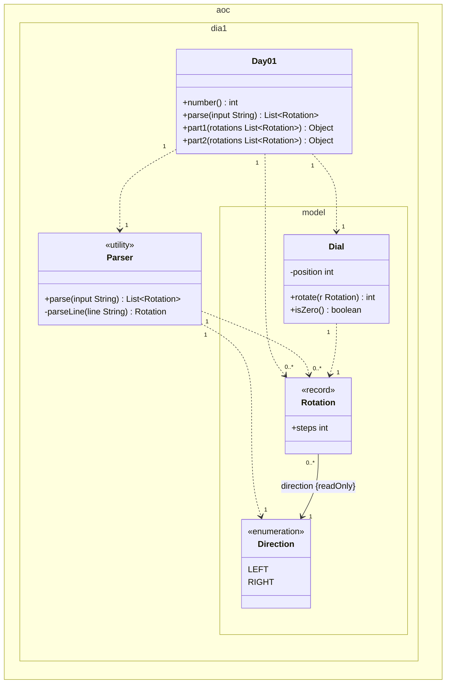
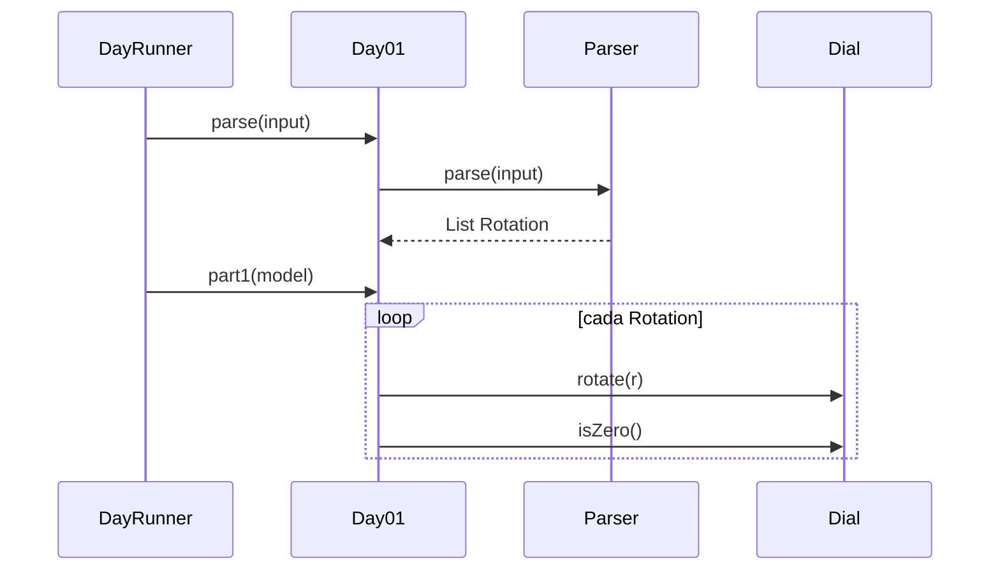

# Día 1 — Secret Entrance

> Documentación **arquitectónica** del módulo `aoc.dia1`.  
> Visión global: [ARQUITECTURA.md](./ARQUITECTURA.md).

---

## 1. Resumen del problema

- Dial circular 0–99, posición inicial 50.
- Entrada: rotaciones `L`/`R` + distancia por línea.
- **Parte 1:** veces que el dial queda en `0` al **terminar** cada rotación.
- **Parte 2:** veces que pasa por `0` en **cualquier clic** de la rotación.

---

## 2. Contrato del día

```java
public class Day01 implements Day<List<Rotation>>
```

| Parte | Entrada (modelo) | Salida | Delegación |
|-------|------------------|--------|------------|
| parse | `String` | `List<Rotation>` | `Parser` |
| part1 | `List<Rotation>` | `int` | `Dial.rotate` + `isZero` |
| part2 | `List<Rotation>` | `int` | `Dial.rotate` (cuenta clics en 0) |

El modelo se parsea **una vez**; ambas partes reutilizan la misma lista.

---

## 3. Estructura de paquetes

```
aoc.dia1/
├── Day01.java
├── Parser.java
└── model/
    ├── Dial.java
    ├── Rotation.java      record
    └── Direction.java       enum
```

---

## 4. Catálogo de clases

| Clase | Rol | API principal | Depende de |
|-------|-----|---------------|------------|
| **Day01** | Orquestador; implementa `Day<List<Rotation>>` | `parse`, `part1`, `part2` | `Parser`, `Dial` |
| **Parser** | Adapta líneas `L68` → `Rotation` | `parse(String)` | `Lines`, `Direction` |
| **Dial** | Estado del dial + reglas de giro | `rotate(Rotation)`, `isZero()` | `Rotation`, aritmética modular |
| **Rotation** | VO inmutable: dirección + pasos | record | `Direction` |
| **Direction** | `LEFT` / `RIGHT` | enum | — |

---

## 5. Modelo de clases UML

Diagrama de clases del módulo `aoc.dia1` (estructura actual del código). Notación UML 2.5:

- Tres compartimentos por clase: **nombre**, **atributos**, **operaciones**.
- Visibilidad (`+`/`-`): **solo** en atributos y operaciones dentro de la caja. Las flechas entre clases no llevan `+`/`-`.
- **`{readOnly}`, rol y multiplicidad** en referencias a otras clases: van en el **extremo de la asociación** (en la flecha), no repetidos como atributo en el compartimento.
- **`{static}`** (opcional): en UML indica que una operación pertenece a la **clase**, no a cada instancia (en Java: `static`). Va **dentro de la caja**, nunca en las flechas. Si la clase ya lleva `<<utility>>`, no hace falta repetir `{static}` en cada método: toda la clase es estática en la práctica.
- **Dependencia** (`..>`): uso o creación puntual; multiplicidad en la flecha.
- **Asociación** (`-->`): enlace estructural; rol, multiplicidad y `{readOnly}` en el extremo correspondiente.
- **Enumeración** (`<<enumeration>>`): literales sin visibilidad.
- No se incluyen tipos externos (`Day`, `Lines`, `List`).

**`Rotation`.** `direction` se modela solo con la asociación `direction {readOnly}` hacia el enum. `steps` es `int` (sin clase en el diagrama): queda como `+steps : int` en la caja — no hay flecha hacia otro tipo; la inmutabilidad del record es inherente al diseño Java del record.

**`Parser` y `{static}`.** En Java `Parser.parse` es `static`: se llama como `Parser.parse(input)` sin crear un objeto. En UML eso es una operación de la clase; el estereotipo `<<utility>>` ya indica que no hay instancias con estado. Por eso no repetimos `{static}` en cada método.



| Relación | Multiplicidad | Motivo en el código |
|----------|---------------|---------------------|
| `Day01` → `Parser` | `1` : `1` | Una instancia de `Day01` delega el parseo en la clase `Parser`. |
| `Day01` → `Dial` | `1` : `1` | Cada ejecución de `part1`/`part2` crea **un** `Dial` local. |
| `Day01` → `Rotation` | `1` : `0..*` | `parse` devuelve una lista; `part1`/`part2` reciben `List<Rotation>`. |
| `Parser` → `Rotation` | `1` : `0..*` | `parse` produce una lista; `parseLine` crea **una** rotación por línea. |
| `Parser` → `Direction` | `1` : `1` | Cada `parseLine` elige **un** literal (`LEFT` o `RIGHT`). |
| `Dial` → `Rotation` | `1` : `1` | `rotate(r)` recibe **una** rotación por llamada (el bucle en `Day01` repite la llamada). |
| `Rotation` → `Direction` | `0..*` : `1` | Rol `direction` en la asociación, extremo `{readOnly}` (inmutable tras construcción). |

---

## 6. Colaboración entre clases



**Parte 1 vs 2:** misma secuencia de rotaciones; `Dial.rotate` en parte 2 devuelve cuántos clics pasaron por 0 (simulación clic a clic internamente).

---

## 7. Decisiones de este día

| Decisión | Motivo |
|----------|--------|
| Estado mutable en `Dial`, datos inmutables en `Rotation` | El dial evoluciona; cada línea del input es un valor fijo |
| Lógica del dial en `model/`, no en `Day01` | SRP: el día solo orquesta; las reglas del puzzle viven en el dominio |
| `Parser` usa `aoc.parse.Lines` | Reutilizar filtrado de líneas en blanco (transversal) |

---

## 8. Patrones

- **Template Method:** `Day01` rellena los hooks del contrato `Day<T>`.
- **Value Object:** `Rotation` (record), `Direction` (enum).
- **Rich domain model:** `Dial` encapsula posición y wrap-around.

---

## 9. Dependencias compartidas

- `aoc.core.Day`
- `aoc.parse.Lines` (en `Parser`)
