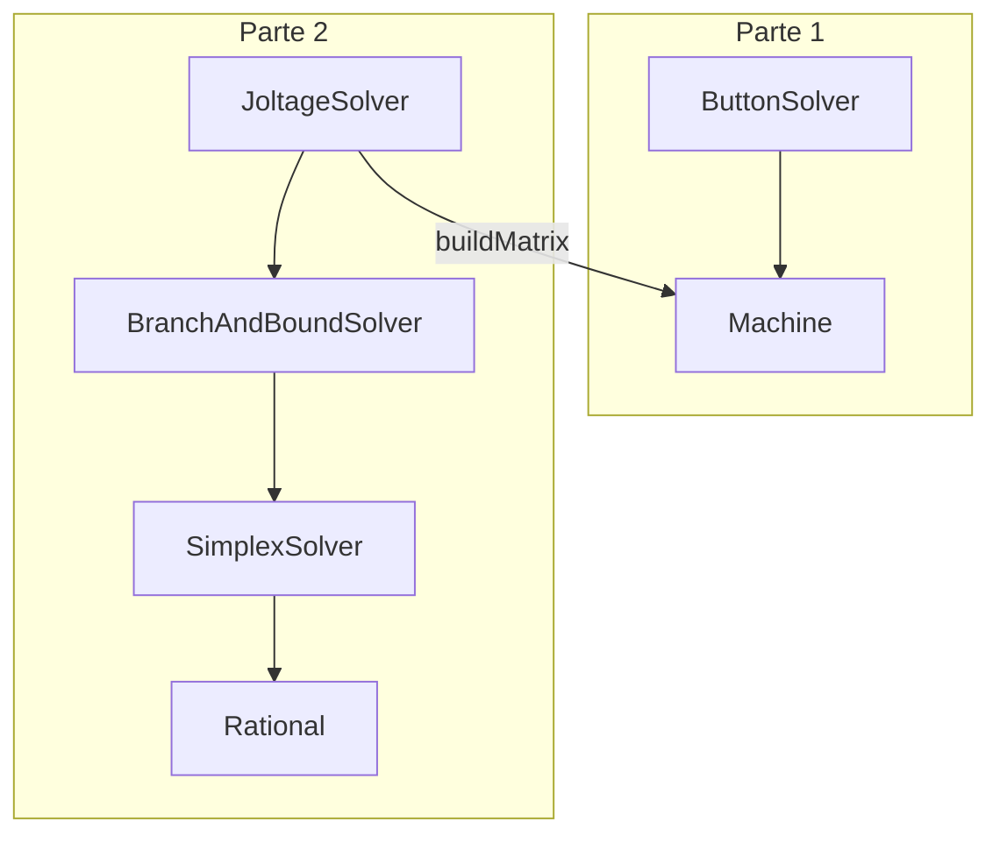

# Día 10 — Factory

> Documentación **arquitectónica** del módulo `aoc.dia10`.  
> Visión global: [ARQUITECTURA.md](./ARQUITECTURA.md).

---

## 1. Resumen del problema

- Cada línea describe una **máquina**: diagrama de luces, botones `(i,j,…)`, joltages `{…}`.
- **Parte 1:** botones alternan luces (XOR); mínimo de pulsaciones por máquina (BFS bitmask).
- **Parte 2:** botones incrementan contadores; alcanzar joltages exactos (ILP entero mínimo).

---

## 2. Contrato del día

```java
public class Day10 implements Day<List<Machine>>
```

| Parte | Delegación | Agregación |
|-------|------------|------------|
| part1 | `ButtonSolver.minPresses` | `stream().mapToInt().sum()` |
| part2 | `JoltageSolver.minPresses` | idem |

---

## 3. Estructura de paquetes

```
aoc.dia10/
├── Day10.java
├── Parser.java
├── optimization/               ← LP exacto (enriquecimiento local)
│   ├── Rational.java
│   ├── SimplexSolver.java
│   └── BranchAndBoundSolver.java
└── model/
    ├── Machine.java            record
    ├── ButtonSolver.java       BFS parte 1
    └── JoltageSolver.java      fachada parte 2
```

---

## 4. Catálogo de clases

### Orquestación y parseo

| Clase | Rol | API |
|-------|-----|-----|
| **Day10** | Suma resultados por máquina | `parse`, `part1`, `part2` |
| **Parser** | Regex + bitmasks + joltages | `parse(String)` → `List<Machine>` |
| **Machine** | VO: `lights`, `target`, `buttons`, `joltages` | record |

### Parte 1 — dominio

| Clase | Rol | API |
|-------|-----|-----|
| **ButtonSolver** | BFS sobre estados `0…2^n-1` | `minPresses(Machine)` |

Vecinos: `s XOR buttonMask`. Espacio ≤ 8192 nodos.

### Parte 2 — dominio + optimización

| Clase | Rol | API |
|-------|-----|-----|
| **JoltageSolver** | **Facade:** `Machine` → matrices → B&B | `minPresses(Machine)` |
| **Rational** | Fracciones exactas (`BigInteger`) | `of`, `add`, `sub`, `mul`, `div`, … |
| **SimplexSolver** | LP relajado dos fases | `solve(A, b, c, k, n)` → `Rational[]` |
| **BranchAndBoundSolver** | Enteriza con ramificación | `solve(A, b, c, k, n)` → `int` |

**Formulación ILP:** minimizar Σxⱼ s.a. Ax = b, x ≥ 0 entero; A[i][j] = bit i del botón j.

---

## 5. Colaboración entre clases



`ButtonSolver` y `optimization/*` **no se mezclan**: algoritmos distintos para reglas distintas del enunciado.

---

## 6. Decisiones de este día

| Decisión | Motivo |
|----------|--------|
| Extraer `optimization/` | ~260 líneas de simplex+B&B; frágil y reutilizable solo aquí |
| `JoltageSolver` como fachada en `model/` | Punto de entrada del dominio; oculta LP |
| `Rational` separado de simplex | Aritmética exacta vs tableau; testabilidad |
| `Machine.buttons` compartido | Misma lista: bitmask (p1) y columnas de A (p2) |
| No poner simplex en `aoc` global | Solo el día 10 necesita LP exacto |

---

## 7. Patrones

- **Facade:** `JoltageSolver`.
- **Adapter:** construcción de matrices desde `Machine`.
- **Value Object:** `Machine`, `Rational`.
- **Clase de utilidad:** solvers con constructor privado.

---

## 8. Dependencias compartidas

- `aoc.parse.Lines`
- `aoc.core.Day`

---

## 9. Notas de rendimiento

- Parte 2: ~500 ms/input real (B&B + simplex por máquina).
- Parseo único vía `Day<T>` evita repetir ese coste entre partes.
