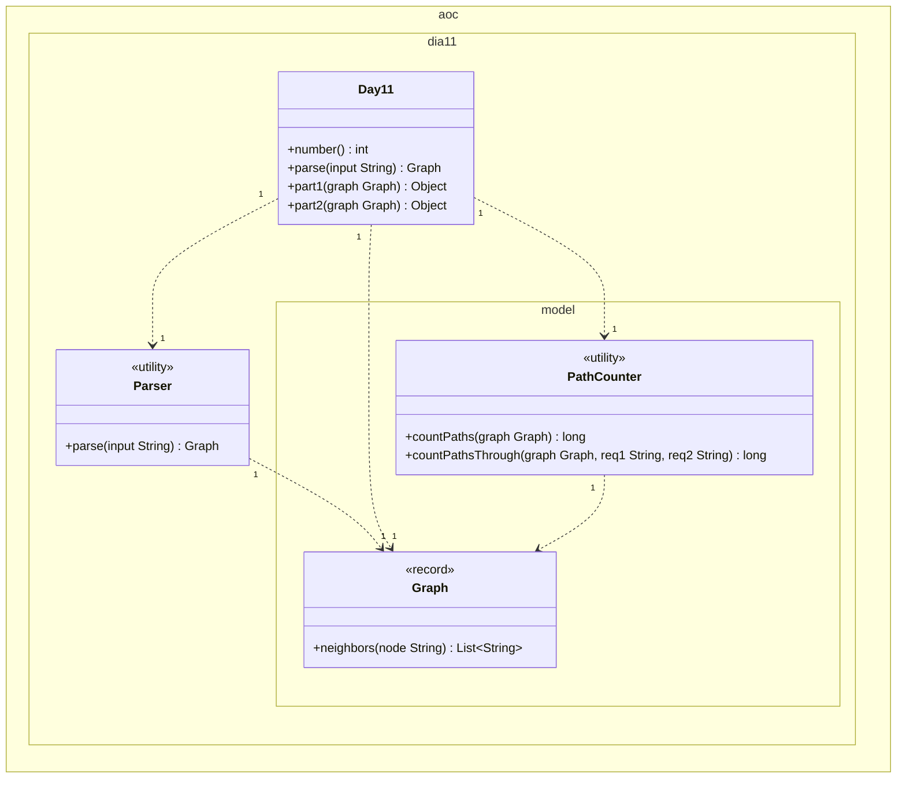

# Día 11 — Reactor

> Documentación **arquitectónica** del módulo `aoc.dia11`.  
> Visión global: [ARQUITECTURA.md](./ARQUITECTURA.md).

---

## 1. Resumen del problema

- Grafo dirigido acíclico: `nodo: dest1 dest2` por línea.
- **Parte 1:** número de caminos `you` → `out`.
- **Parte 2:** caminos `svr` → `out` que visitan **ambos** `dac` y `fft`.

---

## 2. Contrato del día

```java
public class Day11 implements Day<Graph>
```

| Parte | Delegación |
|-------|------------|
| part1 | `PathCounter.countPaths(graph)` |
| part2 | `PathCounter.countPathsThrough(graph, "dac", "fft")` |

El modelo parseado es el **grafo de dominio**, no un `Map` crudo.

---

## 3. Estructura de paquetes

```
aoc.dia11/
├── Day11.java
├── Parser.java
└── model/
    ├── Graph.java         record
    └── PathCounter.java
```

---

## 4. Catálogo de clases

| Clase | Rol | API principal | Depende de |
|-------|-----|---------------|------------|
| **Day11** | Orquestador | `parse`, `part1`, `part2` | `Parser`, `PathCounter` |
| **Parser** | Líneas → adyacencias | `parse(String)` → `Graph` | `Lines` |
| **Graph** | VO inmutable del DAG | `neighbors(node)` | `Map` interno |
| **PathCounter** | DFS + memoización | `countPaths`, `countPathsThrough` | `Graph` |

### `PathCounter` — dos modos

| Método | Estado memoizado | Condición base |
|--------|------------------|----------------|
| `countPaths` | `Map<String, Long>` por nodo | `out` → 1 |
| `countPathsThrough` | `Map<String, long[4]>` nodo × máscara 0–3 | `out` y máscara == 3 → 1 |

La máscara codifica si ya se visitó `dac` (bit 1) y/o `fft` (bit 2).

---

## 5. Modelo de clases UML

Diagrama de clases del módulo `aoc.dia11`. Notación UML 2.5 (misma convención que días 1–10):

- Visibilidad (`+`/`-`): **solo** dentro de cada caja; las flechas no llevan `+`/`-`.
- **`<<utility>>`**: sustituye repetir `{static}` en cada método.
- **Dependencia** (`..>`): creación o uso puntual con multiplicidad.
- No se incluyen `Day`, `Lines`, `Map`, `List`, ni `String`.

**`Graph`.** El record envuelve `Map<String, List<String>>` (JDK); no se modela. La API de dominio es `+neighbors`.

**Parte 1 vs parte 2.** Mismo `Graph`. Parte 1: `countPaths` (`you` → `out`). Parte 2: `countPathsThrough` con nodos obligatorios `"dac"` y `"fft"` (máscara de bits en memo).



| Relación | Multiplicidad | Motivo en el código |
|----------|---------------|---------------------|
| `Day11` → `Parser` | `1` : `1` | `parse` delega en `Parser`. |
| `Day11` → `Graph` | `1` : `1` | Un único grafo parseado para ambas partes. |
| `Day11` → `PathCounter` | `1` : `1` | `part1` / `part2` delegan en métodos distintos. |
| `Parser` → `Graph` | `1` : `1` | Cada `parse` construye el DAG. |
| `PathCounter` → `Graph` | `1` : `1` | DFS consulta `neighbors` por nodo. |

**Memo interna.** `Map<String, Long>` (parte 1) y `Map<String, long[]>` (parte 2) no aparecen en el diagrama.

---

## 6. Colaboración entre clases

```
Parser → Graph(adjacency)
PathCounter → dfs desde nodo origen
  └─ for next in graph.neighbors(node): acumular dfs(next)
```

`Day11` no conoce la estructura del mapa; solo pasa `Graph` al contador.

---

## 7. Decisiones de este día

| Decisión | Motivo |
|----------|--------|
| Record `Graph` (Fase 3 del plan) | Sustituir `Map<String,List<String>>` crudo por API de dominio |
| `neighbors` con lista vacía por defecto | Evitar null checks en el DFS |
| Parte 2 con máscara de bits | Solo 2 nodos obligatorios → 4 estados por nodo, memo compacto |
| Sin subpaquete extra | 2 clases de modelo cohesivas; fichero manejable |

---

## 8. Patrones

- **Value Object:** `Graph`.
- **Memoization** (técnica algorítmica en `PathCounter`).

---

## 9. Dependencias compartidas

- `aoc.parse.Lines`
- `aoc.core.Day`

---

## 10. Resultados verificados

- Parte 1: `714`
- Parte 2: `333852915427200`
