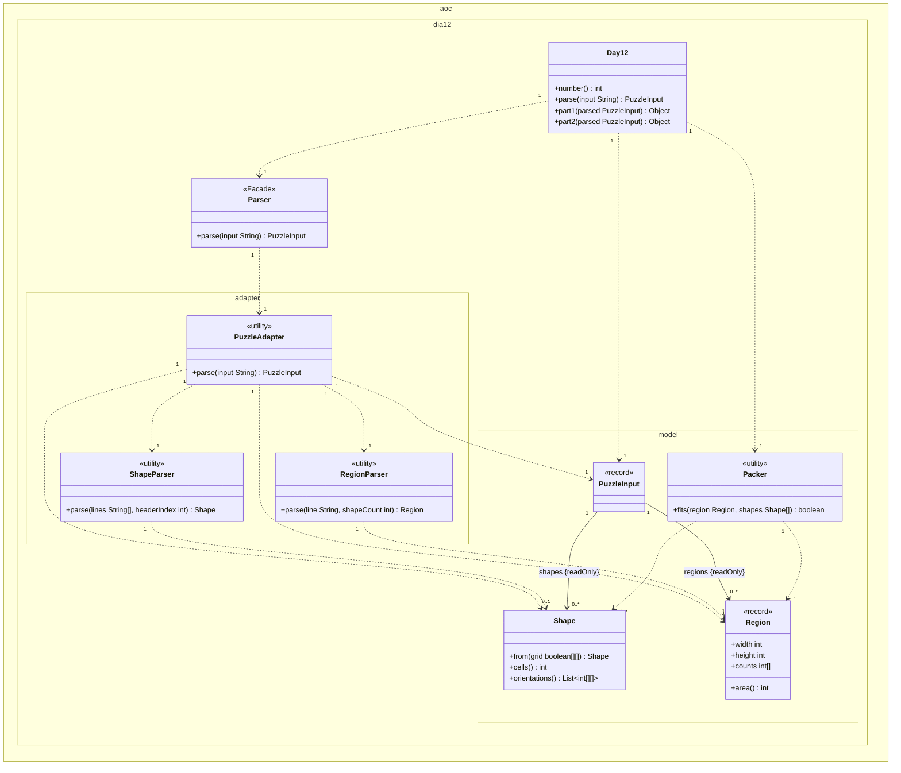
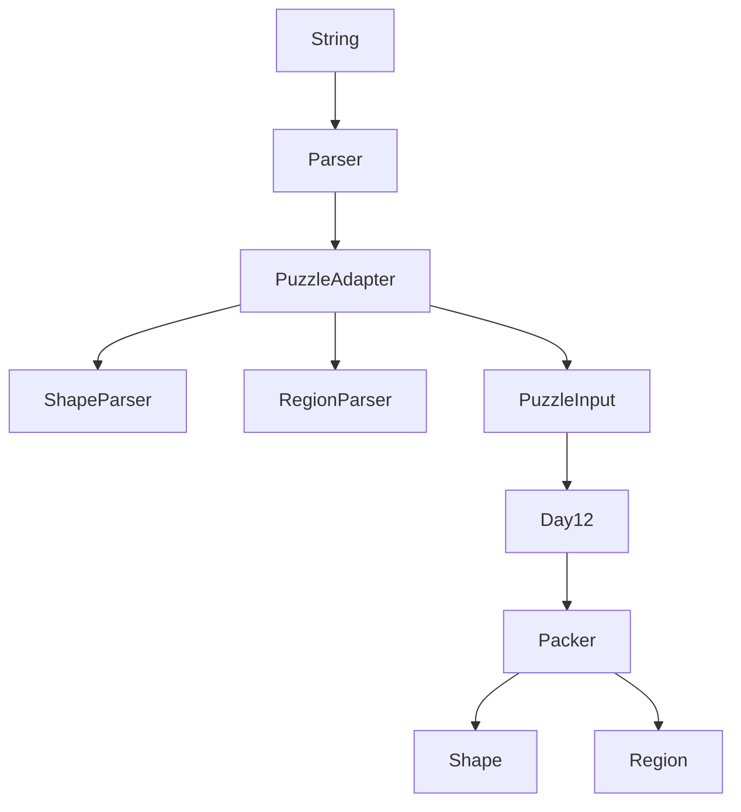

# Día 12 — Christmas Tree Farm

> Documentación **arquitectónica** del módulo `aoc.dia12`.  
> Visión global: [ARQUITECTURA.md](./ARQUITECTURA.md).

---

## 1. Resumen del problema

- **Figuras:** polióminos 3×3 numerados (`0:`, `1:`, …).
- **Regiones:** `WxH: c0 c1 …` — cuántos regalos de cada figura caben en la rejilla.
- **Parte 1:** contar regiones donde **todos** los regalos caben (rotación/volteo, sin solapar `#`).
- **Parte 2:** estrella gratis (sin puzzle).

Empaquetado con celdas vacías permitidas (packing, no cobertura exacta).

---

## 2. Contrato del día

```java
public class Day12 implements Day<PuzzleInput>
```

```java
public record PuzzleInput(Shape[] shapes, List<Region> regions) {}
```

| Parte | Lógica |
|-------|--------|
| part1 | Por cada `Region`: `Packer.fits(region, shapes)` → contar `true` |
| part2 | Mensaje fijo (estrella automática) |

---

## 3. Estructura de paquetes

```
aoc.dia12/
├── Day12.java
├── Parser.java                 fachada pública
├── adapter/                    ← NO confundir con aoc.parse
│   ├── PuzzleAdapter.java
│   ├── ShapeParser.java
│   └── RegionParser.java
└── model/
    ├── PuzzleInput.java
    ├── Shape.java
    ├── Region.java
    └── Packer.java
```

---

## 4. Catálogo de clases

### Orquestación

| Clase | Rol | API |
|-------|-----|-----|
| **Day12** | Itera regiones y cuenta las que caben | `parse`, `part1`, `part2` |
| **Parser** | **Facade** de parseo (convención del proyecto) | `parse(String)` → delega en `PuzzleAdapter` |

### `adapter/` — entrada multi-formato

| Clase | Rol | API |
|-------|-----|-----|
| **PuzzleAdapter** | Orquesta scan línea a línea | `parse(String)` → `PuzzleInput` |
| **ShapeParser** | Bloque `N:` + 3 filas 3×3 | `parse(lines, i)` → `Shape` |
| **RegionParser** | Línea `WxH: counts…` | `parse(line, shapeCount)` → `Region` |

### `model/` — dominio y algoritmo

| Clase | Rol | API |
|-------|-----|-----|
| **PuzzleInput** | VO agregado parseado | `shapes()`, `regions()` |
| **Shape** | Poliómino + orientaciones precalculadas | `from(grid)`, `orientations()`, `cells()` |
| **Region** | Dimensiones + vector de cantidades | record |
| **Packer** | Backtracking con poda por área | `fits(Region, Shape[])` |

---

## 5. Modelo de clases UML

Diagrama de clases del módulo `aoc.dia12` (incluye subpaquete `adapter`). Notación UML 2.5 (misma convención que días 1–11):

- Visibilidad (`+`/`-`): **solo** dentro de cada caja; las flechas no llevan `+`/`-`.
- **`<<utility>>` / `<<Facade>>`**: sustituyen repetir `{static}`; `Parser` es fachada delgada, `adapter/*` son adaptadores estáticos.
- **Asociación** (`-->`): rol y `{readOnly}` en la flecha; no duplicar como atributo en la caja.
- **Dependencia** (`..>`): creación o uso puntual con multiplicidad.
- No se incluyen `Day`, `List`, `boolean[][]`, ni matrices internas (`int[][]`).

**`PuzzleInput`.** Roles `shapes {readOnly}` y `regions {readOnly}` en flechas (los crea `PuzzleAdapter`; el record solo referencia).

**Parte 1 vs parte 2.** Parte 1: `Packer.fits` por cada `Region`. Parte 2: mensaje fijo en `Day12` (sin solver).



| Relación | Multiplicidad | Motivo en el código |
|----------|---------------|---------------------|
| `Day12` → `Parser` | `1` : `1` | `parse` delega en la fachada. |
| `Day12` → `PuzzleInput` | `1` : `1` | Modelo parseado para ambas partes. |
| `Day12` → `Packer` | `1` : `1` | `part1` evalúa cada región. |
| `Parser` → `PuzzleAdapter` | `1` : `1` | Delegación única del parseo. |
| `PuzzleAdapter` → `PuzzleInput` | `1` : `1` | Ensambla figuras y regiones. |
| `PuzzleAdapter` → `ShapeParser` | `1` : `1` | Bloques `N:` + 3 filas. |
| `PuzzleAdapter` → `RegionParser` | `1` : `1` | Líneas `WxH: counts…`. |
| `PuzzleAdapter` → `Shape` | `1` : `0..*` | Acumula figuras al escanear. |
| `PuzzleAdapter` → `Region` | `1` : `0..*` | Acumula regiones al escanear. |
| `ShapeParser` → `Shape` | `1` : `1` | Un bloque 3×3 → una figura. |
| `RegionParser` → `Region` | `1` : `1` | Una línea → una región. |
| `PuzzleInput` → `Shape` | `1` : `0..*` | Rol `shapes {readOnly}`. |
| `PuzzleInput` → `Region` | `1` : `0..*` | Rol `regions {readOnly}`. |
| `Packer` → `Region` | `1` : `1` | `fits` recibe una región por invocación. |
| `Packer` → `Shape` | `1` : `0..*` | Usa orientaciones precalculadas del array. |

**Detalle interno.** Backtracking (`search`, `place`, `unplace`), rejilla `occupied` y orientaciones precalculadas no aparecen en el diagrama.

---

## 6. Colaboración entre clases



**Flujo `Packer.fits`:**
1. Cota necesaria: `requiredCells ≤ area` → si no, `false`.
2. `search(from, remaining, holeBudget)`: primera celda vacía → colocar figura o declarar hueco.
3. `place` / `unplace` para backtracking.

---

## 7. Decisiones de este día

| Decisión | Motivo |
|----------|--------|
| Subpaquete `adapter/` (no `parse/`) | Evitar colisión semántica con `aoc.parse` (utilidades genéricas) |
| `Parser.java` en raíz como fachada | Convención uniforme `diaX.Parser` en los 12 días |
| `PuzzleInput` en `model/` | Es el **modelo de dominio**, no detalle de I/O |
| `Shape` precalcula orientaciones | Amortizar rotaciones/volteos en el backtracking |
| Parte 2 en `Day12` sin solver | Comportamiento acordado con el enunciado AoC |

---

## 8. Patrones

- **Adapter:** `PuzzleAdapter`, parsers especializados.
- **Facade:** `Parser` (raíz), agregación en `PuzzleInput`.
- **Backtracking** con undo (`place`/`unplace`) en `Packer`.

---

## 9. Dependencias compartidas

- `aoc.core.Day`
- Normalización `\r\n` en `InputReader` (antes se hacía localmente en este día)

---

## 10. Resultado verificado

- Parte 1: `541`
