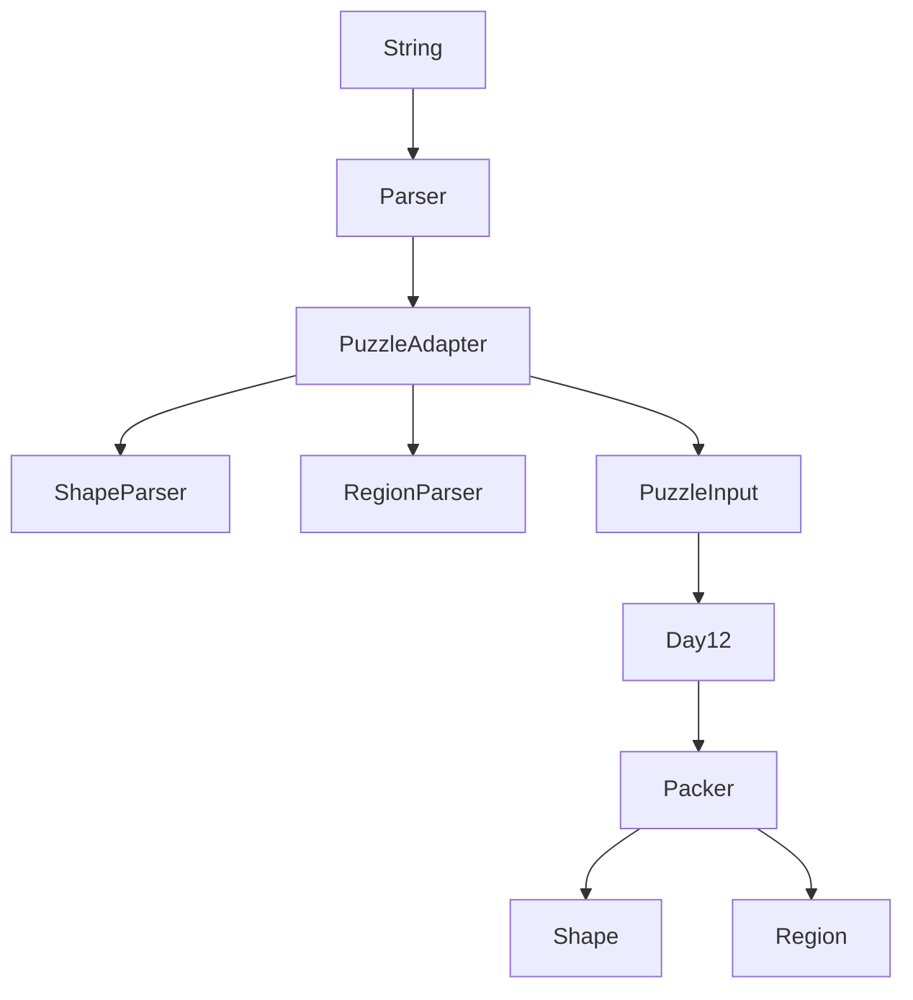

# Día 12 — Christmas Tree Farm

> Documentación **arquitectónica** del módulo `aoc.dia12`.  
> Visión global: [ARQUITECTURA.md](./ARQUITECTURA.md).

---

## 1. Resumen del problema

- **Figuras:** polióminos 3×3 numerados (`0:`, `1:`, …).
- **Regiones:** `WxH: c0 c1 …` — cuántos regalos de cada figura caben en la rejilla.
- **Parte 1:** contar regiones donde **todos** los regalos caben (rotación/volteo, sin solapar `#`).
- **Parte 2:** estrella gratis (sin puzzle).

Empaquetado con celdas vacías permitidas (packing, no cobertura exacta).

---

## 2. Contrato del día

```java
public class Day12 implements Day<PuzzleInput>
```

```java
public record PuzzleInput(Shape[] shapes, List<Region> regions) {}
```

| Parte | Lógica |
|-------|--------|
| part1 | Por cada `Region`: `Packer.fits(region, shapes)` → contar `true` |
| part2 | Mensaje fijo (estrella automática) |

---

## 3. Estructura de paquetes

```
aoc.dia12/
├── Day12.java
├── Parser.java                 fachada pública
├── adapter/                    ← NO confundir con aoc.parse
│   ├── PuzzleAdapter.java
│   ├── ShapeParser.java
│   └── RegionParser.java
└── model/
    ├── PuzzleInput.java
    ├── Shape.java
    ├── Region.java
    └── Packer.java
```

---

## 4. Catálogo de clases

### Orquestación

| Clase | Rol | API |
|-------|-----|-----|
| **Day12** | Itera regiones y cuenta las que caben | `parse`, `part1`, `part2` |
| **Parser** | **Facade** de parseo (convención del proyecto) | `parse(String)` → delega en `PuzzleAdapter` |

### `adapter/` — entrada multi-formato

| Clase | Rol | API |
|-------|-----|-----|
| **PuzzleAdapter** | Orquesta scan línea a línea | `parse(String)` → `PuzzleInput` |
| **ShapeParser** | Bloque `N:` + 3 filas 3×3 | `parse(lines, i)` → `Shape` |
| **RegionParser** | Línea `WxH: counts…` | `parse(line, shapeCount)` → `Region` |

### `model/` — dominio y algoritmo

| Clase | Rol | API |
|-------|-----|-----|
| **PuzzleInput** | VO agregado parseado | `shapes()`, `regions()` |
| **Shape** | Poliómino + orientaciones precalculadas | `from(grid)`, `orientations()`, `cells()` |
| **Region** | Dimensiones + vector de cantidades | record |
| **Packer** | Backtracking con poda por área | `fits(Region, Shape[])` |

---

## 5. Colaboración entre clases



**Flujo `Packer.fits`:**
1. Cota necesaria: `requiredCells ≤ area` → si no, `false`.
2. `search(from, remaining, holeBudget)`: primera celda vacía → colocar figura o declarar hueco.
3. `place` / `unplace` para backtracking.

---

## 6. Decisiones de este día

| Decisión | Motivo |
|----------|--------|
| Subpaquete `adapter/` (no `parse/`) | Evitar colisión semántica con `aoc.parse` (utilidades genéricas) |
| `Parser.java` en raíz como fachada | Convención uniforme `diaX.Parser` en los 12 días |
| `PuzzleInput` en `model/` | Es el **modelo de dominio**, no detalle de I/O |
| `Shape` precalcula orientaciones | Amortizar rotaciones/volteos en el backtracking |
| Parte 2 en `Day12` sin solver | Comportamiento acordado con el enunciado AoC |

---

## 7. Patrones

- **Adapter:** `PuzzleAdapter`, parsers especializados.
- **Facade:** `Parser` (raíz), agregación en `PuzzleInput`.
- **Backtracking** con undo (`place`/`unplace`) en `Packer`.

---

## 8. Dependencias compartidas

- `aoc.core.Day`
- Normalización `\r\n` en `InputReader` (antes se hacía localmente en este día)

---

## 9. Resultado verificado

- Parte 1: `541`
