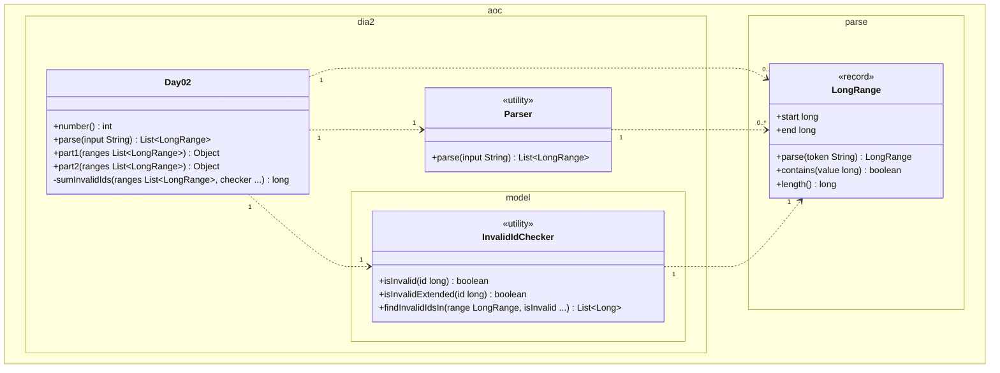

# Día 2 — Gift Shop

> Documentación **arquitectónica** del módulo `aoc.dia2`.  
> Visión global: [ARQUITECTURA.md](./ARQUITECTURA.md).

---

## 1. Resumen del problema

- Entrada: rangos de IDs `a-b` separados por comas.
- **Parte 1:** IDs *inválidos* cuya representación decimal es la mitad repetida (ej. `6464`).
- **Parte 2:** IDs inválidos formados por un patrón repetido (ej. `111`, `121212`).
- Respuesta: suma de todos los IDs inválidos en todos los rangos.

---

## 2. Contrato del día

```java
public class Day02 implements Day<List<LongRange>>
```

| Parte | Modelo | Salida | Criterio (Strategy) |
|-------|--------|--------|---------------------|
| part1 | `List<LongRange>` | `long` | `InvalidIdChecker::isInvalid` |
| part2 | idem | `long` | `InvalidIdChecker::isInvalidExtended` |

---

## 3. Estructura de paquetes

```
aoc.dia2/
├── Day02.java
├── Parser.java
└── model/
    └── InvalidIdChecker.java
```

---

## 4. Catálogo de clases

| Clase | Rol | API principal | Depende de |
|-------|-----|---------------|------------|
| **Day02** | Orquestador; aplica distinta regla por parte | `parse`, `part1`, `part2` | `Parser`, `InvalidIdChecker` |
| **Parser** | Tokeniza rangos `a-b` | `parse(String)` | `LongRange.parse` |
| **InvalidIdChecker** | Reglas de validez + barrido de rango | `isInvalid`, `isInvalidExtended`, `findInvalidIdsIn(range, predicate)` | `LongRange` |

---

## 5. Modelo de clases UML

Diagrama de clases del módulo `aoc.dia2` y el tipo parseado `LongRange` (shared kernel). Notación UML 2.5 (misma convención que el día 1):

- Visibilidad (`+`/`-`): **solo** dentro de cada caja; las flechas no llevan `+`/`-`.
- **`{readOnly}`, rol y multiplicidad** en asociaciones; aquí el modelo es `List<LongRange>` vía **dependencias** con multiplicidad `0..*`.
- **`<<utility>>`**: sustituye repetir `{static}` en cada método (`Parser`, `InvalidIdChecker`).
- No se incluyen `Day`, `List`, `Long`, ni `LongPredicate` (Strategy; ver nota al final).

**`LongRange`.** Record con dos primitivos `start` y `end`: van como `+start : long` y `+end : long` en la caja (interfaz pública del record). No hay flecha hacia otro tipo. `+parse` es factory estática del kernel; no marcamos `{static}` porque no es `<<utility>>` completa.



| Relación | Multiplicidad | Motivo en el código |
|----------|---------------|---------------------|
| `Day02` → `Parser` | `1` : `1` | `parse` delega en `Parser`. |
| `Day02` → `LongRange` | `1` : `0..*` | `parse` devuelve lista; `part1`/`part2` la reciben. |
| `Day02` → `InvalidIdChecker` | `1` : `1` | `sumInvalidIds` delega barrido y reglas. |
| `Parser` → `LongRange` | `1` : `0..*` | Un token `a-b` por coma → un rango; `parse` devuelve todos. |
| `InvalidIdChecker` → `LongRange` | `1` : `1` | `findInvalidIdsIn` recibe un rango por invocación (`flatMap` en `Day02`). |

**Strategy (`LongPredicate`).** `part1` y `part2` pasan distinto criterio a `sumInvalidIds` → `findInvalidIdsIn`. Es tipo JDK; no va como clase en el diagrama (por eso `checker ...` e `isInvalid ...` en las firmas).

---

## 6. Colaboración entre clases

```
Day02.partN(ranges)
  └─ sumInvalidIds(ranges, LongPredicate)
       └─ por cada LongRange:
            InvalidIdChecker.findInvalidIdsIn(range, predicate)
                 └─ for id in [start..end]: if predicate.test(id) → acumular
```

`Day02` no implementa las reglas: solo elige la **estrategia** (`LongPredicate`) y suma.

---

## 7. Decisiones de este día

| Decisión | Motivo |
|----------|--------|
| Eliminar `IdRange` local → `aoc.parse.LongRange` | Mismo concepto que día 5; DRY transversal |
| `LongPredicate` como parámetro | Partes 1 y 2 comparten el bucle; solo cambia la regla |
| Lógica de patrones en `InvalidIdChecker` estático | Sin estado; funciones puras sobre `long` |

---

## 8. Patrones

- **Strategy:** `LongPredicate` intercambiable entre partes (method references).
- **Value Object:** `LongRange` compartido (`contains`, `length`).
- **Template Method:** flujo común en `sumInvalidIds`.

---

## 9. Dependencias compartidas

- `aoc.parse.LongRange` — parseo y rango inclusivo
- `aoc.core.Day`
