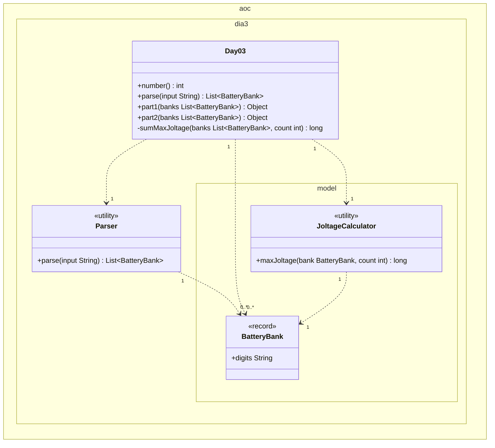

# Día 3 — Lobby

> Documentación **arquitectónica** del módulo `aoc.dia3`.  
> Visión global: [ARQUITECTURA.md](./ARQUITECTURA.md).

---

## 1. Resumen del problema

- Cada línea es un banco de baterías (dígitos).
- Hay que elegir **k** dígitos en orden (greedy por máximo joltage) y formar un número.
- **Parte 1:** k = 2. **Parte 2:** k = 12.
- Respuesta: suma del joltage máximo de cada banco.

---

## 2. Contrato del día

```java
public class Day03 implements Day<List<BatteryBank>>
```

| Constante | Valor | Uso |
|-----------|-------|-----|
| `PART1_BATTERIES` | 2 | part1 |
| `PART2_BATTERIES` | 12 | part2 |

Ambas partes llaman a `sumMaxJoltage(banks, k)` con distinto `k`.

---

## 3. Estructura de paquetes

```
aoc.dia3/
├── Day03.java
├── Parser.java
└── model/
    ├── BatteryBank.java    record(digits)
    └── JoltageCalculator.java
```

---

## 4. Catálogo de clases

| Clase | Rol | API principal | Depende de |
|-------|-----|---------------|------------|
| **Day03** | Orquestador; parametriza k por parte | `parse`, `part1`, `part2` | `Parser`, `JoltageCalculator` |
| **Parser** | Una línea → un `BatteryBank` | `parse(String)` | `Lines` |
| **BatteryBank** | VO: cadena de dígitos del banco | `digits()` | — |
| **JoltageCalculator** | Selección greedy de k dígitos | `maxJoltage(bank, count)` | `BatteryBank` |

---

## 5. Modelo de clases UML

Diagrama de clases del módulo `aoc.dia3`. Notación UML 2.5 (misma convención que días 1–2):

- Visibilidad (`+`/`-`): **solo** dentro de cada caja; las flechas no llevan `+`/`-`.
- **`<<utility>>`**: sustituye repetir `{static}` en cada método.
- Solo **dependencias** (`..>`) con multiplicidad; no hay composición entre clases del día.
- No se incluyen `Day`, `Lines`, `List`, ni `String`.

**`BatteryBank`.** Record con un solo campo `digits` (`String`, JDK): va como `+digits` en la caja; no hay flecha hacia otra clase. No duplicamos accessor `+digits()` ni `{readOnly}` en el atributo.

**Parte 1 vs parte 2.** Constantes `PART1_BATTERIES` (2) y `PART2_BATTERIES` (12) en `Day03`; no van en el diagrama (detalle interno). Se pasan como `count` a `sumMaxJoltage` → `JoltageCalculator.maxJoltage`.



| Relación | Multiplicidad | Motivo en el código |
|----------|---------------|---------------------|
| `Day03` → `Parser` | `1` : `1` | `parse` delega en `Parser`. |
| `Day03` → `BatteryBank` | `1` : `0..*` | `parse` devuelve lista; `part1`/`part2` la reciben. |
| `Day03` → `JoltageCalculator` | `1` : `1` | `sumMaxJoltage` delega el cálculo greedy. |
| `Parser` → `BatteryBank` | `1` : `0..*` | Una línea → un banco; `parse` devuelve todos. |
| `JoltageCalculator` → `BatteryBank` | `1` : `1` | `maxJoltage` recibe un banco por invocación (`stream` en `Day03`). |

---

## 6. Colaboración entre clases

```
Parser → List<BatteryBank>
Day03 → banks.stream().mapToLong(b → JoltageCalculator.maxJoltage(b, k)).sum()
JoltageCalculator → selectDigits (greedy) → Long.parseLong
```

La variación entre partes está **solo en `Day03`** (constantes nombradas); el algoritmo es el mismo.

---

## 7. Decisiones de este día

| Decisión | Motivo |
|----------|--------|
| Magic numbers → `PART1_BATTERIES` / `PART2_BATTERIES` | Documentar en el orquestador la diferencia entre partes |
| Algoritmo en clase dedicada, no en `Day03` | SRP; el día no conoce la greedy |
| `BatteryBank` como record mínimo | Separar “línea parseada” de la lógica numérica |

---

## 8. Patrones

- **Value Object:** `BatteryBank`.
- **Parametrización por constante:** evita duplicar `part1`/`part2` completos.

---

## 9. Dependencias compartidas

- `aoc.parse.Lines`
- `aoc.core.Day`
