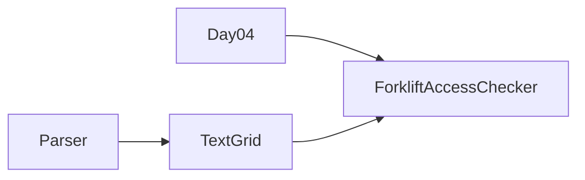

# Día 4 — Printing Department

> Documentación **arquitectónica** del módulo `aoc.dia4`.  
> Visión global: [ARQUITECTURA.md](./ARQUITECTURA.md).

---

## 1. Resumen del problema

- Rejilla de `@` (rollos) y `.` (vacío).
- **Parte 1:** contar `@` con **menos de 4** vecinos `@` (8 direcciones).
- **Parte 2:** iterar: quitar accesibles hasta estabilizar; contar cuántos se eliminaron en total.

---

## 2. Contrato del día

```java
public class Day04 implements Day<TextGrid>
```

El **modelo parseado es directamente** `TextGrid` (utilidad compartida); no hay VO intermedio del día 4.

| Parte | Delegación |
|-------|------------|
| part1 | `ForkliftAccessChecker.countAccessible(grid)` |
| part2 | `ForkliftAccessChecker.countRemovable(grid)` |

---

## 3. Estructura de paquetes

```
aoc.dia4/
├── Day04.java
├── Parser.java
└── model/
    └── ForkliftAccessChecker.java
```

*(Eliminado `Grid` local — sustituido por `aoc.parse.TextGrid`.)*

---

## 4. Catálogo de clases

| Clase | Rol | API principal | Depende de |
|-------|-----|---------------|------------|
| **Day04** | Orquestador delgado | `parse` → `TextGrid`; delega conteos | `Parser`, `ForkliftAccessChecker` |
| **Parser** | Texto → `TextGrid` | `parse(String)` | `TextGrid.fromLines`, `Lines` |
| **ForkliftAccessChecker** | Reglas de accesibilidad y simulación iterativa | `countAccessible`, `countRemovable` | `TextGrid` |

**Parte 1:** snapshot inmutable — solo lectura de la rejilla.  
**Parte 2:** copia mutable de caracteres; bucle quitar-accesibles hasta fijpoint.

---

## 5. Colaboración entre clases



`Day04` no accede a celdas directamente: toda la semántica `@`/vecinos vive en `ForkliftAccessChecker`.

---

## 6. Decisiones de este día

| Decisión | Motivo |
|----------|--------|
| Modelo = `TextGrid` compartido | Misma abstracción que día 7; evita `Grid` duplicado |
| Checker separado del parseo | Formato del input ≠ reglas de accesibilidad |
| Parte 2 con grid mutable interno | La simulación modifica estado; no mutar el `TextGrid` parseado |

---

## 7. Patrones

- **Reutilización de infraestructura:** `TextGrid` como modelo.
- **Servicio de dominio estático:** `ForkliftAccessChecker` sin estado de instancia.

---

## 8. Dependencias compartidas

- `aoc.parse.TextGrid`, `Lines`
- `aoc.core.Day`
