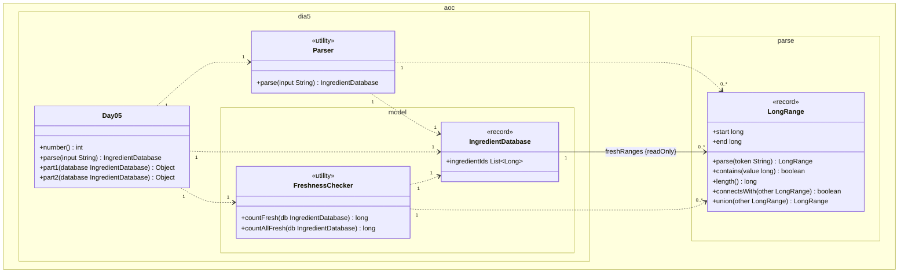

# Día 5 — Cafeteria

> Documentación **arquitectónica** del módulo `aoc.dia5`.  
> Visión global: [ARQUITECTURA.md](./ARQUITECTURA.md).

---

## 1. Resumen del problema

- Input en **dos secciones** (línea en blanco): rangos de frescura e IDs de ingredientes.
- **Parte 1:** cuántos IDs caen en algún rango fresco.
- **Parte 2:** cuántos enteros distintos cubren la unión de rangos (rangos fusionados).

---

## 2. Contrato del día

```java
public class Day05 implements Day<IngredientDatabase>
```

| Parte | Método de dominio |
|-------|-------------------|
| part1 | `FreshnessChecker.countFresh(database)` |
| part2 | `FreshnessChecker.countAllFresh(database)` |

El modelo agrupa rangos e IDs en un solo VO de entrada.

---

## 3. Estructura de paquetes

```
aoc.dia5/
├── Day05.java
├── Parser.java
└── model/
    ├── IngredientDatabase.java   record
    └── FreshnessChecker.java
```

*(Eliminado `FreshRange` — usa `aoc.parse.LongRange`.)*

---

## 4. Catálogo de clases

| Clase | Rol | API principal | Depende de |
|-------|-----|---------------|------------|
| **Day05** | Orquestador | `parse`, `part1`, `part2` | `Parser`, `FreshnessChecker` |
| **Parser** | Dos secciones → `IngredientDatabase` | `parse(String)` | `Sections`, `LongRange` |
| **IngredientDatabase** | VO: rangos + lista de IDs | `freshRanges()`, `ingredientIds()` | `LongRange` |
| **FreshnessChecker** | Consultas de frescura y fusión de rangos | `countFresh`, `countAllFresh` | `IngredientDatabase`, `LongRange` |

**`countAllFresh`:** ordena rangos, fusiona adyacentes/solapados con `connectsWith` + `union`, suma `length()`.

---

## 5. Modelo de clases UML

Diagrama de clases del módulo `aoc.dia5` y el tipo compartido `LongRange`. Notación UML 2.5 (misma convención que días 1–4):

- Visibilidad (`+`/`-`): **solo** dentro de cada caja; las flechas no llevan `+`/`-`.
- **`<<utility>>`**: sustituye repetir `{static}` en cada método.
- **Asociación** (`-->`): rol, multiplicidad y `{readOnly}` en el extremo de la flecha; no duplicar como atributo en la caja.
- **Dependencia** (`..>`): creación o uso puntual con multiplicidad.
- No se incluyen `Day`, `Sections`, `List`, ni `Long`.

**`IngredientDatabase`.** `freshRanges` → asociación `freshRanges {readOnly}` hacia `LongRange` (los crea `Parser`, no el record). `ingredientIds` → `+ingredientIds` en la caja (`Long` JDK, sin clase en el diagrama).

**Parte 1 vs parte 2.** Mismo `IngredientDatabase`. `countFresh` usa IDs y rangos; `countAllFresh` fusiona rangos (`connectsWith`, `union`) e ignora IDs.



| Relación | Multiplicidad | Motivo en el código |
|----------|---------------|---------------------|
| `Day05` → `Parser` | `1` : `1` | `parse` delega en `Parser`. |
| `Day05` → `IngredientDatabase` | `1` : `1` | Un único agregado parseado para ambas partes. |
| `Day05` → `FreshnessChecker` | `1` : `1` | `part1` / `part2` delegan en métodos distintos. |
| `Parser` → `IngredientDatabase` | `1` : `1` | Cada `parse` construye un record. |
| `Parser` → `LongRange` | `1` : `0..*` | Un rango por línea en la primera sección. |
| `FreshnessChecker` → `IngredientDatabase` | `1` : `1` | Cada método recibe una base de datos. |
| `FreshnessChecker` → `LongRange` | `1` : `0..*` | Consulta o fusiona colecciones de rangos. |
| `IngredientDatabase` → `LongRange` | `1` : `0..*` | Rol `freshRanges {readOnly}` en la asociación. |

**`ingredientIds`.** Atributo `+ingredientIds` en la caja (elementos `Long`, JDK). Solo interviene en `countFresh` (parte 1).

---

## 6. Colaboración entre clases

```
Parser
  ├─ Sections.split(input) → [bloque rangos, bloque IDs]
  └─ IngredientDatabase(ranges, ids)

Day05.part1 → FreshnessChecker.countFresh(db)
  └─ stream ids.filter(id → any range.contains(id))

Day05.part2 → FreshnessChecker.countAllFresh(db)
  └─ mergeRanges → suma longitudes
```

`Day05` no expone `freshRanges()` al exterior; la parte 2 no filtra IDs sueltos.

---

## 7. Decisiones de este día

| Decisión | Motivo |
|----------|--------|
| `IngredientDatabase` como record compuesto | Un solo objeto parseado para ambas partes |
| `countAllFresh(IngredientDatabase)` vs filtrar en `Day05` | Encapsular fusión de rangos en el dominio |
| `LongRange.connectsWith` / `union` en `aoc.parse` | Comportamiento reutilizable del value object |

---

## 8. Patrones

- **Value Object:** `IngredientDatabase`, `LongRange`.
- **Facade de datos:** el record agrupa lo que el parser produce.

---

## 9. Dependencias compartidas

- `aoc.parse.Sections`, `LongRange`
- `aoc.core.Day`
