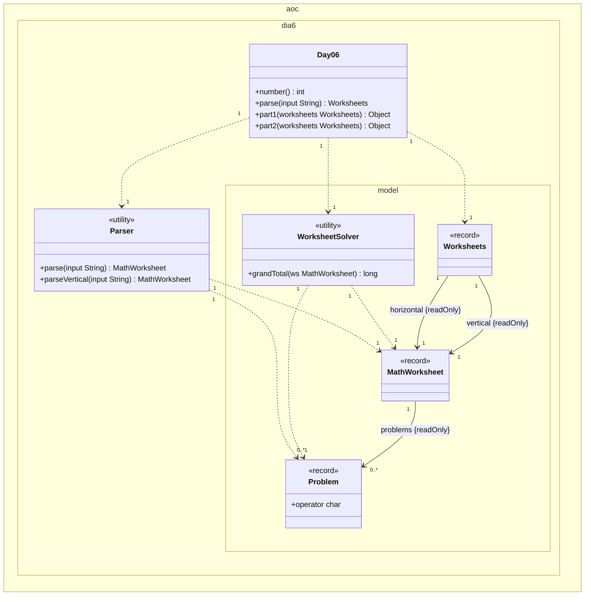
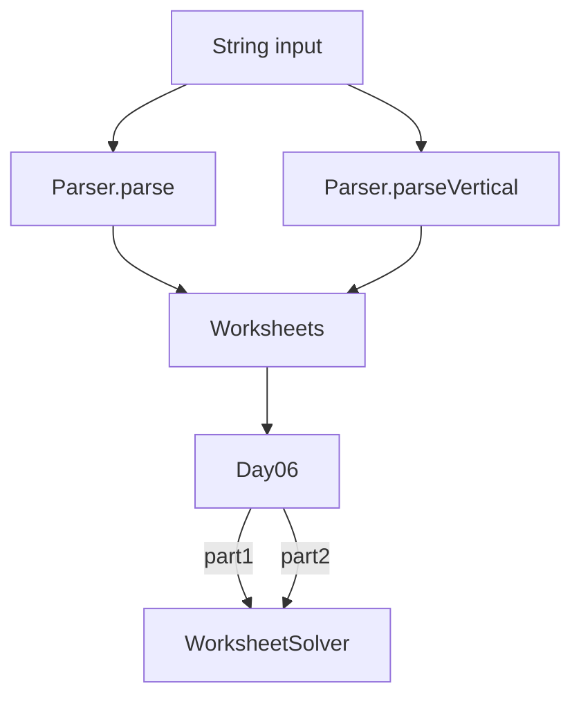

# Día 6 — Workbook

> Documentación **arquitectónica** del módulo `aoc.dia6`.  
> Visión global: [ARQUITECTURA.md](./ARQUITECTURA.md).

---

## 1. Resumen del problema

- Misma entrada física, **dos lecturas** distintas del layout numérico.
- **Parte 1:** problemas en filas (operador al final de cada fila de números).
- **Parte 2:** problemas en columnas leídas de derecha a izquierda.
- Respuesta: suma de resultados de todos los problemas.

---

## 2. Contrato del día

```java
public class Day06 implements Day<Worksheets>
```

```java
public record Worksheets(MathWorksheet horizontal, MathWorksheet vertical) {}
```

| Fase | Acción |
|------|--------|
| `parse` | Construye **ambas** hojas: `Parser.parse` + `Parser.parseVertical` |
| part1 | `WorksheetSolver.grandTotal(horizontal)` |
| part2 | `WorksheetSolver.grandTotal(vertical)` |

Un solo parseo produce las dos vistas; evita releer el string.

---

## 3. Estructura de paquetes

```
aoc.dia6/
├── Day06.java
├── Parser.java
└── model/
    ├── Worksheets.java      record contenedor
    ├── MathWorksheet.java   record(List Problem)
    ├── Problem.java         record(numbers, operator)
    └── WorksheetSolver.java
```

---

## 4. Catálogo de clases

| Clase | Rol | API principal | Depende de |
|-------|-----|---------------|------------|
| **Day06** | Orquestador; compone `Worksheets` en parse | `parse`, `part1`, `part2` | `Parser`, `WorksheetSolver` |
| **Parser** | Lectura horizontal y vertical | `parse`, `parseVertical` | `Lines`, columnas del input |
| **Worksheets** | VO compuesto: dos hojas del mismo input | record | `MathWorksheet` |
| **MathWorksheet** | Lista de problemas | `problems()` | `Problem` |
| **Problem** | Números + operador `+` o `*` | record | — |
| **WorksheetSolver** | Evalúa y suma problemas | `grandTotal(MathWorksheet)` | `Problem` |

---

## 5. Modelo de clases UML

Diagrama de clases del módulo `aoc.dia6`. Notación UML 2.5 (misma convención que días 1–5):

- Visibilidad (`+`/`-`): **solo** dentro de cada caja; las flechas no llevan `+`/`-`.
- **`<<utility>>`**: sustituye repetir `{static}` en cada método.
- **Asociación** (`-->`): rol, multiplicidad y `{readOnly}` en la flecha; no duplicar como atributo ni accessor en la caja.
- **Dependencia** (`..>`): creación o uso puntual con multiplicidad.
- No se incluyen `Day`, `Lines`, `List`, ni `Long`.

**Records y flechas.** `Worksheets` enlaza dos hojas con roles `horizontal` y `vertical {readOnly}` (las crea `Parser`; `Day06` solo ensambla). `MathWorksheet` enlaza `problems {readOnly}` hacia `Problem` (los crea `Parser`). `Problem`: solo `+operator char` en la caja; `numbers` (`List<Long>` JDK) no se modela.

**Parte 1 vs parte 2.** `parse` invoca `Parser.parse` y `Parser.parseVertical`. `part1`/`part2` pasan hoja horizontal o vertical al mismo `WorksheetSolver.grandTotal`.



| Relación | Multiplicidad | Motivo en el código |
|----------|---------------|---------------------|
| `Day06` → `Parser` | `1` : `1` | `parse` invoca `parse` y `parseVertical`. |
| `Day06` → `Worksheets` | `1` : `1` | Construye un contenedor con dos hojas. |
| `Day06` → `WorksheetSolver` | `1` : `1` | `part1`/`part2` delegan en `grandTotal`. |
| `Parser` → `MathWorksheet` | `1` : `1` | Cada método de lectura devuelve una hoja. |
| `Parser` → `Problem` | `1` : `0..*` | Un problema por grupo de columnas. |
| `WorksheetSolver` → `MathWorksheet` | `1` : `1` | Recibe horizontal o vertical. |
| `WorksheetSolver` → `Problem` | `1` : `1` | `solve` evalúa un problema por invocación. |
| `Worksheets` → `MathWorksheet` | `1` : `1` | Roles `horizontal` / `vertical {readOnly}`. |
| `MathWorksheet` → `Problem` | `1` : `0..*` | Rol `problems {readOnly}`. |

**`numbers` en `Problem`.** Elementos `Long` (JDK); no aparecen en el diagrama.

---

## 6. Colaboración entre clases



El solver es **idéntico** para ambas partes; solo cambia qué `MathWorksheet` recibe.

---

## 7. Decisiones de este día

| Decisión | Motivo |
|----------|--------|
| Record `Worksheets` | Modelar explícitamente que parte 1 y 2 comparten input pero no layout |
| Dos métodos en `Parser`, no flags | Cada lectura tiene lógica distinta; nombres claros |
| `WorksheetSolver` agnóstico de orientación | Una sola implementación de `+`/`*` |

---

## 8. Patrones

- **Composite ligero:** `Worksheets` agrupa dos hojas.
- **Value Object:** records anidados inmutables.

---

## 9. Dependencias compartidas

- `aoc.parse.Lines`
- `aoc.core.Day`
