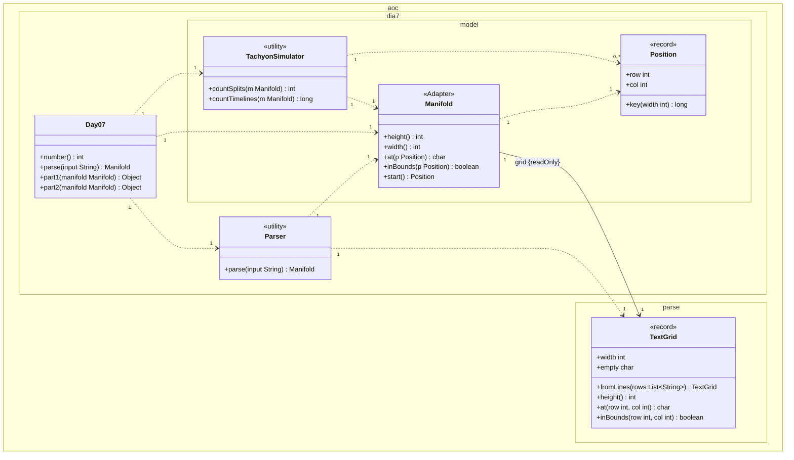

# Día 7 — Laboratories

> Documentación **arquitectónica** del módulo `aoc.dia7`.  
> Visión global: [ARQUITECTURA.md](./ARQUITECTURA.md).

---

## 1. Resumen del problema

- Rejilla con `S` (origen), `.` (vacío) y `^` (splitter).
- Tachyon baja en columna; al chocar con `^` se bifurca izquierda/derecha.
- **Parte 1:** contar splits (bifurcaciones).
- **Parte 2:** contar timelines (camino con multiplicidad / conteo de rutas).

---

## 2. Contrato del día

```java
public class Day07 implements Day<Manifold>
```

| Parte | Delegación |
|-------|------------|
| part1 | `TachyonSimulator.countSplits(manifold)` |
| part2 | `TachyonSimulator.countTimelines(manifold)` |

---

## 3. Estructura de paquetes

```
aoc.dia7/
├── Day07.java
├── Parser.java
└── model/
    ├── Manifold.java       record — adapter sobre TextGrid
    ├── Position.java       record
    └── TachyonSimulator.java
```

---

## 4. Catálogo de clases

| Clase | Rol | API principal | Depende de |
|-------|-----|---------------|------------|
| **Day07** | Orquestador | `parse`, `part1`, `part2` | `Parser`, `TachyonSimulator` |
| **Parser** | Líneas → `Manifold` | `parse(String)` | `TextGrid`, `Lines` |
| **Manifold** | **Adapter:** rejilla + API con `Position` + búsqueda de `S` | `at(Position)`, `start()`, `inBounds` | `TextGrid`, `Position` |
| **Position** | Celda `(row, col)` + clave para `Set` | `key(width)` | — |
| **TachyonSimulator** | Simulación BFS / conteo de rutas | `countSplits`, `countTimelines` | `Manifold`, `Position` |

---

## 5. Modelo de clases UML

Diagrama de clases del módulo `aoc.dia7` y el tipo compartido `TextGrid`. Notación UML 2.5 (misma convención que días 1–6):

- Visibilidad (`+`/`-`): **solo** dentro de cada caja; las flechas no llevan `+`/`-`.
- **`<<utility>>`**: sustituye repetir `{static}` en cada método.
- **Asociación** (`-->`): rol, multiplicidad y `{readOnly}` en la flecha; no duplicar como atributo en la caja.
- **Dependencia** (`..>`): creación o uso puntual con multiplicidad.
- No se incluyen `Day`, `Lines`, `Queue`, `Set`, `Map`, `List`, ni `String`.

**`Manifold` (`<<Adapter>>`).** Enlaza `grid {readOnly}` hacia `TextGrid` (lo crea `Parser`; el record solo lo referencia). Traduce consultas con `Position` sin almacenar posiciones como campo.

**`TextGrid`.** Misma simplificación que día 4: `+width`, `+empty` en la caja; `rows` (`List<String>` JDK) no se modela.

**`Position`.** Record con `+row int`, `+col int` en la caja; `+key(width)` para claves en visitados/memo.

**Parte 1 vs parte 2.** Mismo `Manifold`. `countSplits` (BFS) en parte 1; `countTimelines` (DFS memoizado) en parte 2. `TachyonSimulator` no accede a `TextGrid` directamente.



| Relación | Multiplicidad | Motivo en el código |
|----------|---------------|---------------------|
| `Day07` → `Parser` | `1` : `1` | `parse` delega en `Parser`. |
| `Day07` → `Manifold` | `1` : `1` | Un único manifold parseado para ambas partes. |
| `Day07` → `TachyonSimulator` | `1` : `1` | `part1` / `part2` delegan en métodos distintos. |
| `Parser` → `Manifold` | `1` : `1` | Cada `parse` construye un adaptador. |
| `Parser` → `TextGrid` | `1` : `1` | Crea la rejilla que se pasa al record. |
| `Manifold` → `TextGrid` | `1` : `1` | Rol `grid {readOnly}`. |
| `Manifold` → `Position` | `1` : `1` | Argumentos de `at`/`inBounds`; `start()` devuelve una (no es campo). |
| `TachyonSimulator` → `Manifold` | `1` : `1` | Cada método público recibe un manifold. |
| `TachyonSimulator` → `Position` | `1` : `0..*` | Colas, visitados y memo crean muchas posiciones. |

---

## 6. Colaboración entre clases

```
Parser → TextGrid.fromLines → new Manifold(grid)
TachyonSimulator → usa Manifold (no TextGrid directo)
  ├─ start() localiza 'S'
  ├─ BFS con Queue Position + visited
  └─ part2: memoización / multiplicidad de haces
```

La semántica del día 7 habla en **posiciones nombradas**; `Manifold` traduce al grid genérico.

---

## 7. Decisiones de este día

| Decisión | Motivo |
|----------|--------|
| `Manifold` envuelve `TextGrid` (Adapter) | Reutilizar parseo de rejilla del día 4 sin duplicar `Grid` |
| `Position` propio del día 7 | No unificar con `Tile` (día 9): fila/columna vs x/y del enunciado |
| Simulador separado de `Manifold` | El manifold es el *espacio*; el simulador es el *algoritmo* |

---

## 8. Patrones

- **Adapter:** `Manifold` → `TextGrid`.
- **Value Object:** `Position` (record).

---

## 9. Dependencias compartidas

- `aoc.parse.TextGrid`, `Lines`
- `aoc.core.Day`
