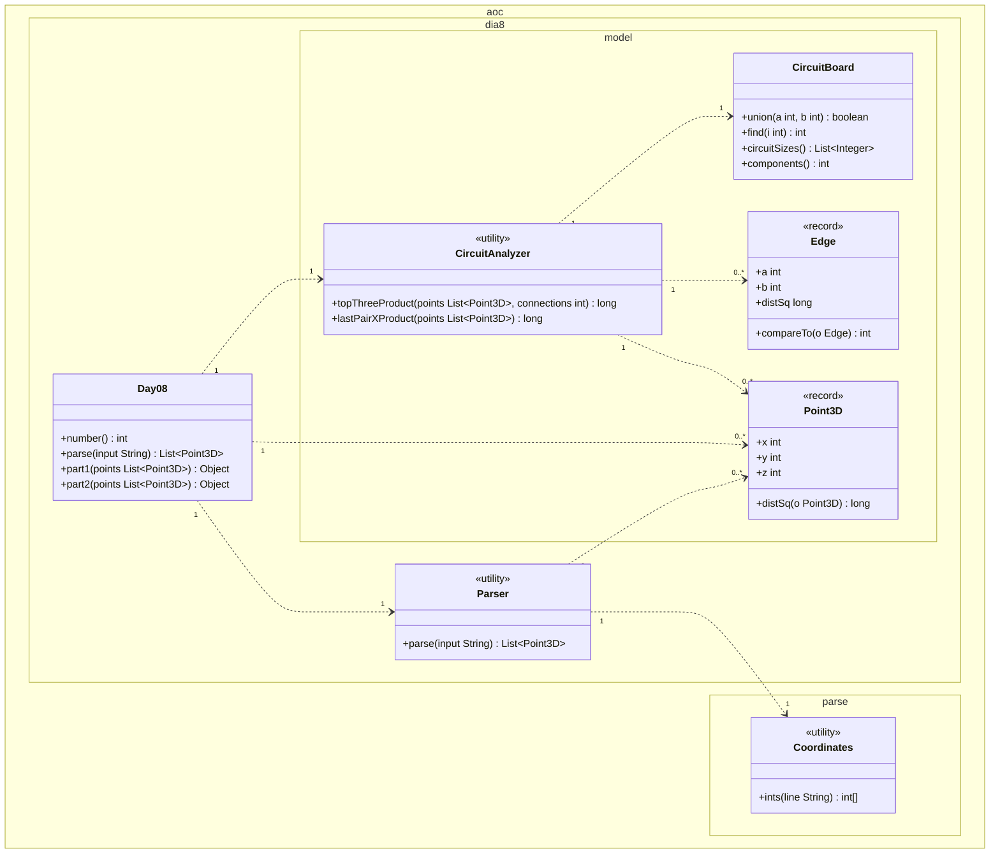

# Día 8 — Playground

> Documentación **arquitectónica** del módulo `aoc.dia8`.  
> Visión global: [ARQUITECTURA.md](./ARQUITECTURA.md).

---

## 1. Resumen del problema

- Lista de puntos 3D.
- **Parte 1:** unir los **1000** pares más cercanos (distancia euclídea); producto de tamaños de los 3 circuitos más grandes.
- **Parte 2:** seguir uniendo por distancia creciente hasta un solo circuito; producto de `x` del último par unido.

---

## 2. Contrato del día

```java
public class Day08 implements Day<List<Point3D>>
```

| Constante | Valor |
|-----------|-------|
| `PART1_THRESHOLD` | 1000 (conexiones) |

| Parte | Delegación |
|-------|------------|
| part1 | `CircuitAnalyzer.topThreeProduct(points, PART1_THRESHOLD)` |
| part2 | `CircuitAnalyzer.lastPairXProduct(points)` |

---

## 3. Estructura de paquetes

```
aoc.dia8/
├── Day08.java
├── Parser.java
└── model/
    ├── Point3D.java         record
    ├── Edge.java            record Comparable
    ├── CircuitBoard.java    Union-Find
    └── CircuitAnalyzer.java orquesta edges + union
```

---

## 4. Catálogo de clases

| Clase | Rol | API principal | Depende de |
|-------|-----|---------------|------------|
| **Day08** | Orquestador; umbral parte 1 como constante | `parse`, `part1`, `part2` | `Parser`, `CircuitAnalyzer` |
| **Parser** | Líneas `x,y,z` → puntos | `parse(String)` | `Coordinates`, `Lines` |
| **Point3D** | VO 3D + `distSq` | record | — |
| **Edge** | Arista ponderada entre índices | `compareTo` por distancia | `Point3D` |
| **CircuitBoard** | Union-Find con rank | `union`, `find`, `circuitSizes`, `components` | — |
| **CircuitAnalyzer** | Genera todas las aristas, ordena, aplica uniones | `topThreeProduct`, `lastPairXProduct` | `CircuitBoard`, `Edge` |

---

## 5. Modelo de clases UML

Diagrama de clases del módulo `aoc.dia8` y el tipo parseado `Coordinates`. Notación UML 2.5 (misma convención que días 1–7):

- Visibilidad (`+`/`-`): **solo** dentro de cada caja; las flechas no llevan `+`/`-`.
- **`<<utility>>`**: sustituye repetir `{static}` en cada método.
- **Dependencia** (`..>`): creación o uso puntual con multiplicidad (`0..*` para la lista de puntos).
- No se incluyen `Day`, `Lines`, `List`, `Comparable`, ni arrays internos de Union-Find.

**Colección de puntos.** `parse` devuelve `List<Point3D>` en Java; en el diagrama se modela como dependencias `0..*` hacia `Point3D` (no hay clase contenedora). `PART1_THRESHOLD` (1000) es constante interna de `Day08`; no aparece en la caja.

**`Edge`.** Arista entre **índices** (`a`, `b`) con peso `distSq`; la crea `CircuitAnalyzer` a partir de pares de `Point3D`. No almacena referencias a puntos.

**Parte 1 vs parte 2.** Mismo conjunto de puntos. Parte 1: `topThreeProduct` con límite de uniones; parte 2: `lastPairXProduct` hasta un solo circuito.



| Relación | Multiplicidad | Motivo en el código |
|----------|---------------|---------------------|
| `Day08` → `Parser` | `1` : `1` | `parse` delega en `Parser`. |
| `Day08` → `Point3D` | `1` : `0..*` | `parse` devuelve lista; `part1`/`part2` la reciben. |
| `Day08` → `CircuitAnalyzer` | `1` : `1` | `part1` / `part2` delegan en métodos distintos. |
| `Parser` → `Point3D` | `1` : `0..*` | Una línea `x,y,z` → un punto. |
| `Parser` → `Coordinates` | `1` : `1` | `parseLine` usa `ints` por línea. |
| `CircuitAnalyzer` → `Point3D` | `1` : `0..*` | Genera aristas entre todos los pares. |
| `CircuitAnalyzer` → `Edge` | `1` : `0..*` | `allEdges` crea O(n²) aristas ordenables. |
| `CircuitAnalyzer` → `CircuitBoard` | `1` : `1` | Cada método público instancia un Union-Find. |

**Union-Find interno.** `parent`, `rank` y `link` no aparecen en el diagrama (detalle de implementación).

---

## 6. Colaboración entre clases

```
Parser → List<Point3D>
CircuitAnalyzer
  ├─ allEdges: O(n²) pares con distSq
  ├─ sorted edges
  ├─ part1: limit(1000).forEach(union) → top 3 component sizes → producto
  └─ part2: for each edge until components==1 → x₁·x₂ del último union real
```

`Day08` no conoce Union-Find; solo parametriza el umbral de la parte 1.

---

## 7. Decisiones de este día

| Decisión | Motivo |
|----------|--------|
| `Point3D` local (no global) | Semántica “punto de circuito 3D”, distinta de `Tile` 2D |
| `Edge` como record ordenable | Separar generación de aristas de la estructura union-find |
| `PART1_THRESHOLD` en `Day08` | Magic number del enunciado visible en el orquestador |

---

## 8. Patrones

- **Value Object:** `Point3D`, `Edge`.
- **Servicio de dominio:** `CircuitAnalyzer` coordina estructura + algoritmo.

*(Union-Find es patrón algorítmico clásico, no GoF.)*

---

## 9. Dependencias compartidas

- `aoc.parse.Coordinates`, `Lines`
- `aoc.core.Day`
