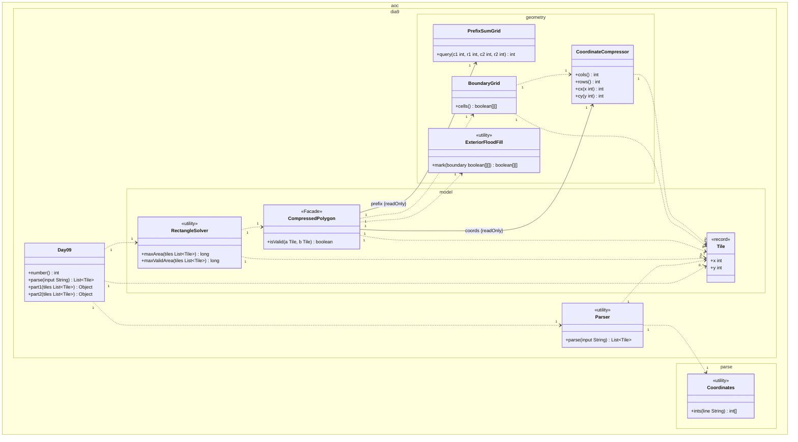
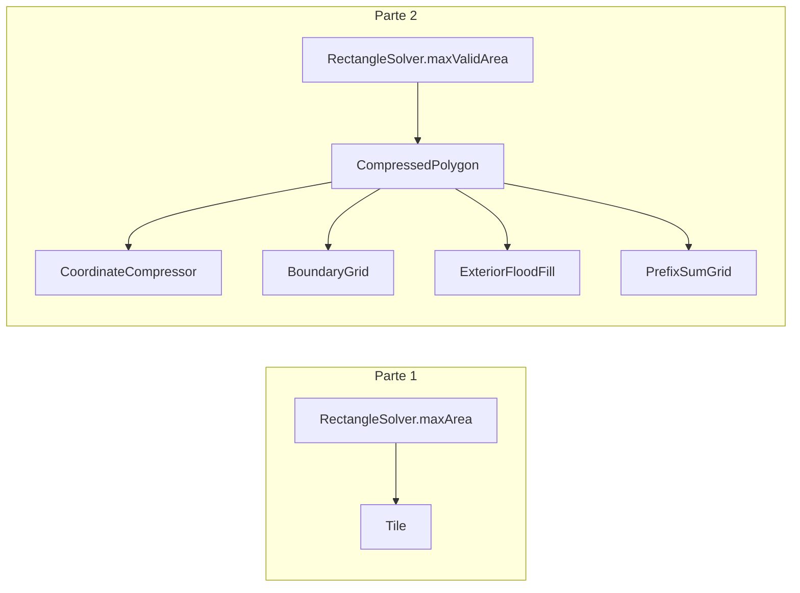

# Día 9 — Movie Theater

> Documentación **arquitectónica** del módulo `aoc.dia9`.  
> Visión global: [ARQUITECTURA.md](./ARQUITECTURA.md).

---

## 1. Resumen del problema

- Teselas rojas forman un polígono (segmentos verdes entre consecutivos + interior).
- **Parte 1:** máximo área de rectángulo con esquinas en teselas rojas (cualquier par).
- **Parte 2:** mismo criterio pero **todas** las celdas del rectángulo deben ser rojas o verdes.

---

## 2. Contrato del día

```java
public class Day09 implements Day<List<Tile>>
```

| Parte | Delegación |
|-------|------------|
| part1 | `RectangleSolver.maxArea(tiles)` — O(n²) pares |
| part2 | `RectangleSolver.maxValidArea(tiles)` — usa `CompressedPolygon` |

---

## 3. Estructura de paquetes

```
aoc.dia9/
├── Day09.java
├── Parser.java
├── geometry/                    ← pipeline geométrico (enriquecimiento local)
│   ├── CoordinateCompressor.java
│   ├── BoundaryGrid.java
│   ├── ExteriorFloodFill.java
│   └── PrefixSumGrid.java
└── model/
    ├── Tile.java
    ├── RectangleSolver.java
    └── CompressedPolygon.java   ← fachada del pipeline
```

---

## 4. Catálogo de clases

### Capa orquestación

| Clase | Rol | API |
|-------|-----|-----|
| **Day09** | Orquestador delgado | `parse`, `part1`, `part2` |
| **Parser** | `x,y` por línea | `parse(String)` → `List<Tile>` |

### Modelo

| Clase | Rol | API |
|-------|-----|-----|
| **Tile** | VO coordenada 2D | record `(x, y)` |
| **RectangleSolver** | Búsqueda de máximo área | `maxArea`, `maxValidArea` |
| **CompressedPolygon** | **Facade:** validación de rectángulo en O(1) tras preproceso | `isValid(Tile a, Tile b)` |

### `geometry/` — pipeline (solo parte 2)

| Clase | Rol | Entrada → Salida |
|-------|-----|------------------|
| **CoordinateCompressor** | Comprime coords únicas a rejilla 2× | `List<Tile>` → índices `cx`, `cy` |
| **BoundaryGrid** | Marca segmentos del polígono | compressor + tiles → `boolean[][]` |
| **ExteriorFloodFill** | BFS desde borde marca exterior | boundary → `boolean[][] exterior` |
| **PrefixSumGrid** | Suma 2D de celdas válidas (borde ∪ interior) | boundary + exterior → consultas rectangulares |

---

## 5. Modelo de clases UML

Diagrama de clases del módulo `aoc.dia9` (incluye subpaquete `geometry`) y `Coordinates`. Notación UML 2.5 (misma convención que días 1–8):

- Visibilidad (`+`/`-`): **solo** dentro de cada caja; las flechas no llevan `+`/`-`.
- **`<<utility>>`**: sustituye repetir `{static}` en cada método.
- **Asociación** (`-->`): rol y `{readOnly}` en la flecha cuando el agregado conserva la referencia.
- **Dependencia** (`..>`): creación o uso puntual con multiplicidad.
- No se incluyen `Day`, `Lines`, `List`, `Queue`, ni matrices internas (`boolean[][]`, `int[]`).

**Colección de teselas.** `parse` devuelve `List<Tile>` en Java; se modela como dependencias `0..*` hacia `Tile`.

**`CompressedPolygon` (`<<Facade>>`).** En el constructor ejecuta el pipeline: `CoordinateCompressor` → `BoundaryGrid` → `ExteriorFloodFill` → `PrefixSumGrid`. Solo conserva `coords` y `prefix` (asociaciones `{readOnly}`); `BoundaryGrid` y el flood fill son pasos intermedios (dependencias).

**Parte 1 vs parte 2.** Parte 1: `maxArea` (O(n²) pares). Parte 2: `maxValidArea` instancia `CompressedPolygon` y filtra con `isValid`.



| Relación | Multiplicidad | Motivo en el código |
|----------|---------------|---------------------|
| `Day09` → `Parser` | `1` : `1` | `parse` delega en `Parser`. |
| `Day09` → `Tile` | `1` : `0..*` | Lista parseada para ambas partes. |
| `Day09` → `RectangleSolver` | `1` : `1` | `part1` / `part2` delegan en métodos distintos. |
| `Parser` → `Tile` | `1` : `0..*` | Una línea `x,y` → una tesela. |
| `Parser` → `Coordinates` | `1` : `1` | `parseLine` usa `ints`. |
| `RectangleSolver` → `Tile` | `1` : `0..*` | Barrido de pares en ambas partes. |
| `RectangleSolver` → `CompressedPolygon` | `1` : `1` | `maxValidArea` crea una fachada por ejecución. |
| `CompressedPolygon` → `Tile` | `1` : `0..*` | Constructor recibe polígono; `isValid` recibe esquinas. |
| `CompressedPolygon` → `CoordinateCompressor` | `1` : `1` | Rol `coords {readOnly}`. |
| `CompressedPolygon` → `PrefixSumGrid` | `1` : `1` | Rol `prefix {readOnly}`. |
| `CompressedPolygon` → `BoundaryGrid` | `1` : `1` | Objeto temporal en el constructor. |
| `CompressedPolygon` → `ExteriorFloodFill` | `1` : `1` | `mark` sobre el borde. |
| `BoundaryGrid` → `CoordinateCompressor` | `1` : `1` | Mapea segmentos a celdas comprimidas. |
| `BoundaryGrid` → `Tile` | `1` : `0..*` | Segmentos entre teselas consecutivas. |
| `CoordinateCompressor` → `Tile` | `1` : `0..*` | Extrae coordenadas únicas al construir. |

**Detalle interno.** Arrays `xs`/`ys`, copias de rejilla y helpers privados del pipeline no aparecen en el diagrama.

---

## 6. Colaboración entre clases



**Flujo `CompressedPolygon` (constructor):**
`CoordinateCompressor` → `BoundaryGrid` → `ExteriorFloodFill.mark` → `PrefixSumGrid`

**Consulta `isValid`:** mapea esquinas del rectángulo a índices comprimidos; prefix sum debe igualar área del rectángulo en rejilla.

---

## 7. Decisiones de este día

| Decisión | Motivo |
|----------|--------|
| Subpaquete `geometry/` | 4 etapas + fachada; monolito original mezclaba responsabilidades |
| `CompressedPolygon` como fachada en `model/` | API de dominio (`isValid`); detalle geométrico oculto |
| `Tile` no unificado con `Point3D` / `Position` | Coordenadas 2D del teatro vs otros puzzles |
| Área en `long` | Coordenadas grandes → producto hasta ~10¹⁰ |

---

## 8. Patrones

- **Facade:** `CompressedPolygon`.
- **Pipeline:** cadena compressor → borde → flood → prefix.
- **Value Object:** `Tile`.

---

## 9. Dependencias compartidas

- `aoc.parse.Coordinates`, `Lines`
- `aoc.core.Day`
