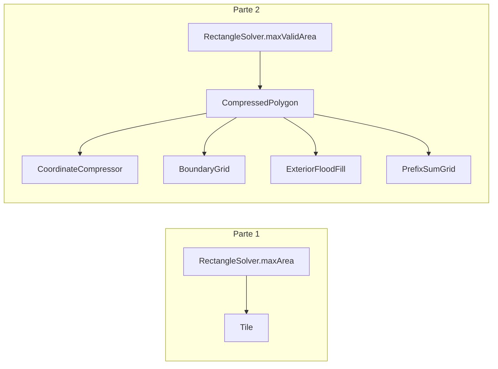

# Día 9 — Movie Theater

> Documentación **arquitectónica** del módulo `aoc.dia9`.  
> Visión global: [ARQUITECTURA.md](./ARQUITECTURA.md).

---

## 1. Resumen del problema

- Teselas rojas forman un polígono (segmentos verdes entre consecutivos + interior).
- **Parte 1:** máximo área de rectángulo con esquinas en teselas rojas (cualquier par).
- **Parte 2:** mismo criterio pero **todas** las celdas del rectángulo deben ser rojas o verdes.

---

## 2. Contrato del día

```java
public class Day09 implements Day<List<Tile>>
```

| Parte | Delegación |
|-------|------------|
| part1 | `RectangleSolver.maxArea(tiles)` — O(n²) pares |
| part2 | `RectangleSolver.maxValidArea(tiles)` — usa `CompressedPolygon` |

---

## 3. Estructura de paquetes

```
aoc.dia9/
├── Day09.java
├── Parser.java
├── geometry/                    ← pipeline geométrico (enriquecimiento local)
│   ├── CoordinateCompressor.java
│   ├── BoundaryGrid.java
│   ├── ExteriorFloodFill.java
│   └── PrefixSumGrid.java
└── model/
    ├── Tile.java
    ├── RectangleSolver.java
    └── CompressedPolygon.java   ← fachada del pipeline
```

---

## 4. Catálogo de clases

### Capa orquestación

| Clase | Rol | API |
|-------|-----|-----|
| **Day09** | Orquestador delgado | `parse`, `part1`, `part2` |
| **Parser** | `x,y` por línea | `parse(String)` → `List<Tile>` |

### Modelo

| Clase | Rol | API |
|-------|-----|-----|
| **Tile** | VO coordenada 2D | record `(x, y)` |
| **RectangleSolver** | Búsqueda de máximo área | `maxArea`, `maxValidArea` |
| **CompressedPolygon** | **Facade:** validación de rectángulo en O(1) tras preproceso | `isValid(Tile a, Tile b)` |

### `geometry/` — pipeline (solo parte 2)

| Clase | Rol | Entrada → Salida |
|-------|-----|------------------|
| **CoordinateCompressor** | Comprime coords únicas a rejilla 2× | `List<Tile>` → índices `cx`, `cy` |
| **BoundaryGrid** | Marca segmentos del polígono | compressor + tiles → `boolean[][]` |
| **ExteriorFloodFill** | BFS desde borde marca exterior | boundary → `boolean[][] exterior` |
| **PrefixSumGrid** | Suma 2D de celdas válidas (borde ∪ interior) | boundary + exterior → consultas rectangulares |

---

## 5. Colaboración entre clases



**Flujo `CompressedPolygon` (constructor):**
`CoordinateCompressor` → `BoundaryGrid` → `ExteriorFloodFill.mark` → `PrefixSumGrid`

**Consulta `isValid`:** mapea esquinas del rectángulo a índices comprimidos; prefix sum debe igualar área del rectángulo en rejilla.

---

## 6. Decisiones de este día

| Decisión | Motivo |
|----------|--------|
| Subpaquete `geometry/` | 4 etapas + fachada; monolito original mezclaba responsabilidades |
| `CompressedPolygon` como fachada en `model/` | API de dominio (`isValid`); detalle geométrico oculto |
| `Tile` no unificado con `Point3D` / `Position` | Coordenadas 2D del teatro vs otros puzzles |
| Área en `long` | Coordenadas grandes → producto hasta ~10¹⁰ |

---

## 7. Patrones

- **Facade:** `CompressedPolygon`.
- **Pipeline:** cadena compressor → borde → flood → prefix.
- **Value Object:** `Tile`.

---

## 8. Dependencias compartidas

- `aoc.parse.Coordinates`, `Lines`
- `aoc.core.Day`
